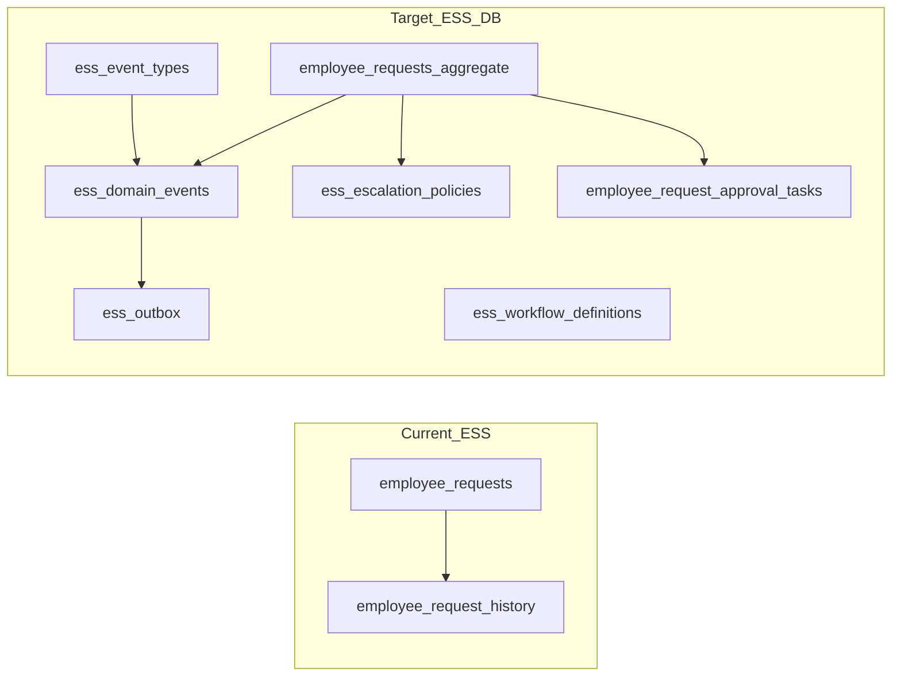

# Employee experience: DB-first enterprise alignment

## Scope boundary (honest split)

| Narrative theme     | In this plan (DB / Drizzle / migrations)                                    | Out of scope here (app, infra, other packages)   |
| ------------------- | --------------------------------------------------------------------------- | ------------------------------------------------ |
| Workflow engine     | **Data model** for definitions, instances, per-step tasks, parallel groups  | State-machine runner, routing rules engine, UI   |
| Domain events       | **Append-only facts**, **catalogued event types**, transactional **outbox** | Kafka/SQS, consumers, retry policy               |
| SLA / escalation    | **Catalog + SLA state enum + timestamps**                                   | Schedulers, reminder jobs, breach evaluators     |
| JSON governance     | **Version columns + CHECKs + documented registry**                          | Runtime schema registry microservice             |
| Survey intelligence | **Versioned immutable snapshots** (`is_locked`), response→version FK        | Branching evaluator, eNPS jobs                   |
| RBAC / ABAC         | Optional **delegation pointer** on tasks                                    | Org-wide permission model (likely `core` / auth) |
| Scale               | **Indexes, partial indexes**, documented future partitioning                | Archival jobs, CQRS projections                  |

**Separation of concerns (enterprise-aligned):** DB holds enforceable truth; execution, messaging, and centralized RBAC stay outside this module—same pattern as Workday BPF vs persistence and SAP workflow vs infotypes.

---

## Cross-cutting: aggregate root discipline

**Invariant model:** `employee_requests` is the **aggregate root** for ESS workflow truth.

- `**aggregate_version` (int, NOT NULL, default 1) on `employee_requests` — optimistic concurrency: increment on each state-changing write; consumers/events can assert expected version.
- **Referential integrity:** `employee_request_approval_tasks` and `ess_domain_events` (for this aggregate) MUST reference `(tenant_id, employee_request_id)` with FK to `employee_requests`; no orphan tasks/events.
- **Event ordering:** domain events carry `aggregate_type` + `aggregate_id` + `aggregate_version` (column on event row, or derived from payload) so projections can reject stale ordering.

Document in hr-docs ADR: boundary = request + its tasks + its event stream for `aggregate_type = 'employee_request'`.

---

## Current baseline (what you have)

- [packages/db/src/schema/hr/employeeExperience.ts](../../packages/db/src/schema/hr/employeeExperience.ts): `employee_requests` with linear `request_status` (`[standardApprovalWorkflowStatuses](../../packages/db/src/schema/hr/_enums.ts)`), single `approved_by` / `approved_at`, `request_data` JSONB without version; `employee_request_history` append-only; surveys with inline `questions` JSONB; notifications with `metadata` only.
- OSS refinement backlog: [employee_experience_db_oss_refinement.plan.md](employee_experience_db_oss_refinement.plan.md).

---

## Phase 1 — SLA and request lifecycle (low coupling)

**Goal:** SLA as **state + time**, not timestamps alone; schedulers still live in app.

- `**employee_requests` additions:
  - `submitted_at` (timestamptz).
  - `sla_due_at`, `first_response_at`, `sla_breached_at` (timestamptz).
  - `**sla_status` enum: `within_sla` | `approaching_breach` | `breached` | `paused` (default `within_sla` or nullable until first SLA attach—product choice; document transition rules in ADR).
  - `**aggregate_version` int NOT NULL DEFAULT 1.
  - Optional FK `escalation_policy_id` → `hr.ess_escalation_policies`.
- `**hr.ess_escalation_policies`: `policy_code`, name, `response_sla_hours`, optional `escalation_rules` JSONB + `rules_schema_version`.
- **CHECKs:** e.g. `sla_breached_at IS NULL OR sla_due_at IS NOT NULL`; `sla_status = 'breached' IMPLIES sla_breached_at IS NOT NULL` (tune); `first_response_at` vs `submitted_at`; `**aggregate_version >= 1`.
- **Indexes:** `(tenant_id, sla_due_at)` partial on open statuses; `(tenant_id, request_status, submitted_at)`.
- **Zod + migration backfill** as before.

---

## Phase 2 — Multi-step / parallel approvals + **decision semantics**

**Goal:** Rows for graph approvals; **audit decision**, not only terminal status.

- `**hr.employee_request_approval_tasks`:
  - `step_key`, `sequence`, `parallel_group_id` (uuid, nullable).
  - `status`: `pending` | `approved` | `rejected` | `skipped` | `cancelled`.
  - `**decision` enum (nullable while pending): `approve` | `reject` | `delegate` | `escalate` — filled when task leaves `pending`.
  - `**decision_reason` text (nullable; required when `decision = reject` if product wants—enforce via CHECK).
  - `assignee_employee_id`, `due_at`, `decided_at`, `decided_by`, optional `delegated_from_employee_id`.
- **CHECKs:** e.g. `status = 'pending' IMPLIES decision IS NULL AND decided_at IS NULL`; terminal statuses imply `decided_at` / `decided_by` pairing; reject + reason if required.
- **Request-level:** coarse `request_status` unchanged; terminal `approved` when all required tasks satisfied (app first; DB constraint optional later).
- `**employee_request_history`: `correlation_id`, `transition_source` (`user` | `system` | `rule` | `migration`).

Optional `**hr.ess_workflow_definitions`** + `**hr.ess_workflow_steps` for template storage; runtime interprets.

---

## Phase 3 — Event type registry + domain events + **idempotent outbox**

**Goal:** No random `event_type` strings; transactional outbox safe for duplicate-publish scenarios.

1. `**hr.ess_event_types` (catalog, tenant-global or tenant-scoped per product):

- Natural key or surrogate PK; columns: `event_type` (text, unique per scope), `aggregate_type`, `payload_schema_version` (int), `is_active` (boolean), optional `description`.
- **Seed/migrate** known types (`RequestSubmitted`, `TaskDecided`, …); app cannot insert events for unknown types if FK enforced.

1. `**hr.ess_domain_events` (append-only):

- `**event_type_id` FK → `ess_event_types` (preferred) or composite FK on `(event_type, payload_schema_version)` if version is part of catalog row.
- `aggregate_type`, `aggregate_id`, `**aggregate_version` (int, optional but recommended), `payload` JSONB, `occurred_at`, `correlation_id`, `causation_id`, actor refs.

1. `**hr.ess_outbox`:

- `event_id` FK, `destination` (text), `published_at`, retry fields.
- **Unique constraint:** `(event_id, destination)` so each event publishes at most once per sink.
- `**idempotency_key` (text, nullable) OR tenant-scoped unique on `(tenant_id, idempotency_key) WHERE idempotency_key IS NOT NULL` for producer-side deduplication.

**Indexes:** `(tenant_id, aggregate_type, aggregate_id, occurred_at)`; outbox `(published_at) WHERE published_at IS NULL`.

---

## Phase 4 — JSONB governance (version + **minimum enforcement**)

- Columns: `request_data_schema_version`, `questions_schema_version`, `responses_schema_version`, `metadata_schema_version`, etc. (NOT NULL default `1` where applicable).
- **CHECK:** `request_data_schema_version >= 1` (and same for other version ints)—stops zero/negative drift; **full shape/version alignment** enforced by Zod + documented allowed map in ADR (single authority list).
- **Zod:** version-keyed shapes in `_zodShared`; reject unknown versions at API boundary.

---

## Phase 5 — Survey versioning + **immutability guarantee**

- `**hr.employee_survey_questionnaire_versions`:** `survey_id`, `version`, `questions` JSONB NOT NULL, `published_at`, `**is_locked` boolean NOT NULL DEFAULT true (or default false until publish, then lock—product rule).
- **Rule:** once `is_locked = true`, **no UPDATE** to `questions` (enforce with trigger, or only INSERT new version rows and treat rows as immutable by convention + app).
- `**survey_responses`: `questionnaire_version_id` FK; backfill path then NOT NULL for new rows.
- Optional: `scoring_model`, `computed_score`, `score_components` JSONB.

---

## Phase 6 — Merge OSS refinement plan

From [employee_experience_db_oss_refinement.plan.md](employee_experience_db_oss_refinement.plan.md): notification `reference_kind` + `reference_id`; `amended_from_request_id`; optional `survey_invitations`; `employee_push_endpoints` for push.

---

## Phase 7 — Performance / ops

- Composite/partial indexes as above; extend [packages/db/src/schema/hr/hr-docs/HR_JSONB_INDEX_AND_PARTITION_RUNBOOK.md](../../packages/db/src/schema/hr/hr-docs/HR_JSONB_INDEX_AND_PARTITION_RUNBOOK.md) for `ess_domain_events` / `ess_outbox` growth (partition by time/tenant when needed).

---

## RBAC / ABAC (positioning)

- Tenant RLS baseline; fine-grained manager/HR scope stays in central auth unless `hr.ess_access_scopes` is explicitly added later.

---

## Deliverables checklist (per phase)

- Drizzle in `employeeExperience.ts` (or split `employeeExperienceWorkflow.ts` if needed).
- Enums in `_enums.ts`: `sla_status`, `approval_task_decision`, `ess_transition_source`, etc.
- Zod + `_zodShared`; idempotent migrations with data repair where CHECKs risk failure.
- **ADR:** ESS aggregate boundary, event catalog, SLA state transitions, locked survey versions.

---

## Suggested implementation order (stabilize truth → structure → emit)

**Rationale:** Avoid “events first → chaos”; align with truth-layer-first strategy (validated enterprise pattern).

1. **Phase 1** (SLA state + `aggregate_version` + escalation catalog) **+ Phase 6** notification/request pointers (high ROI).
2. **Phase 4** (version columns + `CHECK >= 1`) in parallel.
3. **Phase 2** (tasks + **decision** / **decision_reason** + history fields).
4. **Phase 3** — **ship `ess_event_types` before or with** `ess_domain_events` + outbox **unique + idempotency_key**.
5. **Phase 5** (questionnaire versions + **is_locked** / immutability rule).
6. **Phase 7** as volume grows.

This positions the schema as a **generalized workflow + truth platform** for HR first, without rushing UI, automation, or workflow runtime—**database as single source of enforceable truth**, execution layer later.
