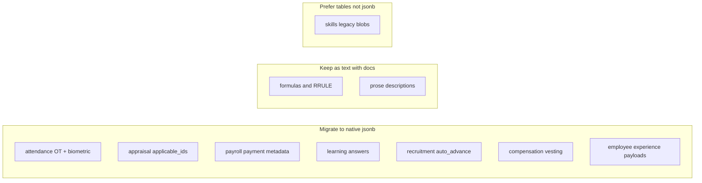

# HR JSONB governance and migration plan (final)

This document merges the **full-module HR JSONB audit** with stakeholder feedback: it is the single planning reference for eliminating “JSON-in-text” inconsistencies, keeping phased execution and CI gates, and documenting **enum vs jsonb vs plain text** so the schema stays auditable and enterprise-ready.

**Canonical scope:** all modules exported from [`../index.ts`](../index.ts) (148 tables in `hr.*`).

**Related docs:** [`SCHEMA_LOCKDOWN.md`](SCHEMA_LOCKDOWN.md), [`HR_SCHEMA_UPGRADE_GUIDE.md`](HR_SCHEMA_UPGRADE_GUIDE.md), [`HR_JSONB_INDEX_AND_PARTITION_RUNBOOK.md`](HR_JSONB_INDEX_AND_PARTITION_RUNBOOK.md).

**Implementation status:** Phases 1–3 are in SQL under `packages/db/migrations/20260329250000_hr_jsonb_phase1_attendance_appraisal`, `20260329250100_hr_jsonb_phase2_payroll_learning_recruit_comp`, and `20260329250200_hr_jsonb_phase3_employee_experience`. Drizzle definitions use native `jsonb` for all uplifted columns (including `biometric_logs.raw_data` and `employee_requests.request_data`). Phase 4 governance is in SCHEMA_LOCKDOWN (enums vs jsonb vs text) and HR_SCHEMA_UPGRADE_GUIDE; biometric JSON-only semantics are noted in SCHEMA_LOCKDOWN.

**Optional optimizations (ongoing):** Structured Zod for surveys, recruitment auto-advance criteria, and biometric `raw_data`; serialized-size guardrails via `HR_JSONB_DEFAULT_MAX_BYTES` in [`_zodShared.ts`](../_zodShared.ts). GIN tuning, TOAST/partitioning guidance, and monitoring queries live in [HR_JSONB_INDEX_AND_PARTITION_RUNBOOK.md](./HR_JSONB_INDEX_AND_PARTITION_RUNBOOK.md) (§§3–9).

---

## Why this matters

- **Consistency:** Columns that hold structured data should use native `jsonb`, not `text` with casts. Queries and indexes stay clearer and cheaper.
- **Auditability:** Pairing JSONB with Zod keeps tenant-specific customization enforceable and reviewable.
- **Governance:** Enums remain for invariant workflow states; JSONB holds tenant dimensions (IDs, mappings, metadata); plain text holds DSLs, RRULEs, and prose. That split prevents “workflow state in JSON” drift.
- **Enterprise readiness:** The result is tenant-scoped flexibility without schema chaos, with CI proving enum/schema pairing and schema quality after each phase.

---

## Strengths of this approach (design principles)

1. **Comprehensive inventory:** The module matrix below maps JSON-in-text, native JSONB, intentional text, and normalization paths. That traceability anchors PRs and reviews.
2. **Phased execution:** Four phases limit blast radius and keep CI manageable: attendance/appraisal/biometric, then payroll/learning/recruitment/compensation, then employee experience in one coordinated change, then governance docs.
3. **Explicit non-goals:** Formulas, RRULE strings, and skills legacy blobs are not “fixed” by moving them to JSONB; documenting why is as important as migrating true JSON fields.
4. **CI integration:** After each phase, run `tsc`, `ci:gate:schema-quality:hr`, `hr-enums-schema-pairing`, `ci:gate:db-access:generate`, and `test:db` so generated access layers and pairing rules stay aligned.

---

## Practical implications by area

| Area | Implication |
|------|-------------|
| **Overtime rules** | `applicable_ids` as JSONB aligns with expense policies and improves tenant-scoped containment queries. GIN should target the column directly (no `text::jsonb`). |
| **Biometric logs** | `raw_data` migration needs data stewardship: invalid JSON may require nulling, transformation, or a documented “JSON-only” policy before `USING …::jsonb`. |
| **Payroll payment metadata** | JSONB enables structured filtering and validation of bank-specific payloads; Zod should replace “JSON string” patterns. |
| **Learning assessment answers** | JSONB supports queryable answer shapes; Zod defines the expected map/array structure. |
| **Recruitment auto-advance** | JSONB supports rule trees; Zod validates criteria safely at the boundary. |
| **Compensation vesting** | JSONB fits arrays such as `{ month, percentage }`; Zod locks the shape. |
| **Employee experience** | JSON-as-text fields were migrated in **one** coordinated phase (migration + Drizzle + Zod) so survey and self-service flows stay consistent. |
| **Governance docs** | Documenting why formulas, RRULEs, and prose stay as **text** prevents contributors from “improving” them by stuffing JSON where a DSL belongs. |

---

## Audit matrix (by module)

| Module | JSON-in-text / cast-GIN (action) | Already native `jsonb` | Intentional `text` (document; do not migrate to JSONB) |
|--------|----------------------------------|-------------------------|--------------------------------------------------------|
| [`attendanceEnhancements.ts`](../attendanceEnhancements.ts) | — | `overtime_rules.applicable_ids`, `biometric_logs.raw_data` (GIN on native `jsonb`) | Codes, notes |
| [`appraisalTemplates.ts`](../appraisalTemplates.ts) | — | `applicable_ids` (mirror [`expenses.ts`](../expenses.ts)) | — |
| [`payroll.ts`](../payroll.ts) | — | `payment_distributions.metadata` | `salary_components.calculation_formula` = formula **DSL string**, not JSON |
| [`learning.ts`](../learning.ts) | — | `assessment_attempts.answers`, `lms_assets.metadata` | Course prose fields (`prerequisites`, etc.) unless product moves to structured blocks |
| [`recruitment.ts`](../recruitment.ts) | — | `pipeline_stages.auto_advance_criteria`, `source_breakdown`, resume parse JSONB columns | — |
| [`compensation.ts`](../compensation.ts) | — | `vesting_percentages` | — |
| [`employeeExperience.ts`](../employeeExperience.ts) | — | `employee_requests.request_data`, `employee_notifications.metadata` (GIN), `employee_surveys.target_audience` / `questions`, `survey_responses.responses` | — |
| [`expenses.ts`](../expenses.ts) | — (reference pattern) | `applicable_ids`, `accounting_map` | — |
| [`grievances.ts`](../grievances.ts) | — | `confidential_notes` | — |
| [`leaveEnhancements.ts`](../leaveEnhancements.ts) | — | `excluded_leave_types` | — |
| [`lifecycle.ts`](../lifecycle.ts) | — | `exit_interviews.feedback` | — |
| [`globalWorkforce.ts`](../globalWorkforce.ts) | — | Compliance `findings`, `action_items` | `recurrence_rule` = **RRULE-style string** |
| [`peopleAnalytics.ts`](../peopleAnalytics.ts) | — | `metadata`, `layout`, `widgets`, `filters`, `shared_with`, `parameters`, snapshot `dimension_value` | `calculation_formula` = expression **DSL text** |
| [`workforceStrategy.ts`](../workforceStrategy.ts) | — | `criteria` (relevant tables) | — |
| `people`, `employment`, `attendance`, `talent`, `policyAcknowledgments`, `operations`, `benefits`, `engagement`, `taxCompliance`, `travel`, `workforcePlanning`, `loans` | No JSON-in-text found in audit | — | Standard scalar/text |
| [`skills.ts`](../skills.ts) | — | Prefer normalized junction tables | Legacy bulk text: **normalize**, not JSONB |

**Net:** The eight uplift areas above are **complete** in migrations + Drizzle + Zod. Everything else was already JSONB, correctly plain text, or explicitly “normalize, don’t jsonb.”

---

## Phased execution

### Phase 1 — Attendance + appraisal (small blast radius)

- [`attendanceEnhancements.ts`](../attendanceEnhancements.ts): `overtime_rules.applicable_ids` → `jsonb` + GIN on the column (remove `::jsonb` cast in index definition); align typing and Zod with [`expenses.ts`](../expenses.ts) (`string[]` or shared schema).
- Same file: `biometric_logs.raw_data` → `jsonb` where payloads are JSON; GIN without cast; clean or null invalid rows before type change.
- [`appraisalTemplates.ts`](../appraisalTemplates.ts): `applicable_ids` → `jsonb`; add GIN if containment queries are required; Zod parity with expense policy scope.

### Phase 2 — Payroll, learning, recruitment, compensation

- [`payroll.ts`](../payroll.ts): `payment_distributions.metadata` → `jsonb`; replace Zod JSON-string patterns with [`_zodShared.ts`](../_zodShared.ts) metadata helpers.
- [`learning.ts`](../learning.ts): `assessment_attempts.answers` → `jsonb` + Zod for the answer shape.
- [`recruitment.ts`](../recruitment.ts): `auto_advance_criteria` → `jsonb` + Zod.
- [`compensation.ts`](../compensation.ts): `vesting_percentages` → `jsonb` + Zod (product-defined array of objects, e.g. month/percentage).

### Phase 3 — Employee experience (single coordinated PR)

- [`employeeExperience.ts`](../employeeExperience.ts): all JSON-as-text fields → `jsonb`; fix GIN indexes that cast `text` to `jsonb`; update Zod for `target_audience`, `questions`, `responses`, `request_data`, `metadata`.

### Phase 4 — Governance documentation

- [`SCHEMA_LOCKDOWN.md`](SCHEMA_LOCKDOWN.md): add **Enums vs jsonb vs plain text** (workflow invariants → enum; tenant scope / metadata / mappings → jsonb + Zod; DSL / RRULE / prose → text).
- [`HR_SCHEMA_UPGRADE_GUIDE.md`](HR_SCHEMA_UPGRADE_GUIDE.md): per-phase migration checklist; list modules **without** JSON uplift so formulas are not wrongly converted.
- Optional short ADR: semantic contract for `biometric_logs.raw_data` (JSON-only vs opaque).

### Migrations (each phase)

- Use `ALTER COLUMN … TYPE jsonb USING …::jsonb` with staging validation; recreate GIN indexes on native `jsonb` columns.

### Verification (each phase)

- `pnpm exec tsc --noEmit -p packages/db`
- `pnpm ci:gate:schema-quality:hr`
- `pnpm ci:gate:hr-enums-schema`
- `pnpm ci:gate:db-access:generate` (then `pnpm ci:gate:db-access` to confirm clean)
- `pnpm db:test`

---

## Maximize auditable flexibility without scope creep

- Do **not** convert `calculation_formula` / `calculationFormula` / `recurrence_rule` to JSONB unless the product adopts a structured AST; document them as intentional text.
- Do **not** use JSONB for [`skills.ts`](../skills.ts) legacy blobs; prefer normalized rows per file guidance.
- **Optional later:** tenant `extension_config jsonb` on selected masters—only if product requests it.

---

## Success criteria (final)

1. No remaining “JSON in `text`” for the audited structured columns above.
2. Every migrated JSONB column has **Zod parity** (arrays, records, or typed objects as appropriate).
3. GIN indexes reference **native** JSONB columns (no `text::jsonb` for those fields).
4. Documentation states clearly:
   - **Enums** = workflow and other invariants the product must not fragment per tenant.
   - **JSONB** = tenant-specific dimensions, metadata, mappings, and rules payloads.
   - **Text** = DSLs, RRULEs, human prose, and opaque references where JSON is not the contract.
5. CI gates above remain green after each phase.
6. Heavy JSONB tables can adopt **partitioning** later as a separate scalability track (document in upgrade guide when introduced).

---

## Implementation checklist (tracking)

Use this list in PRs or issue trackers; statuses belong to the team’s workflow.

| Phase | Task | Status |
|-------|------|--------|
| 1 | `overtime_rules.applicable_ids` + `appraisal_templates.applicable_ids` + `biometric_logs.raw_data` → native JSONB, GIN without cast, Zod parity; SQL migration with data cleanup | Done |
| 2 | `payment_distributions.metadata`, `assessment_attempts.answers`, `auto_advance_criteria`, `vesting_percentages` → JSONB + Zod | Done |
| 3 | `employeeExperience.ts` JSON text columns → JSONB in one coordinated change + Zod + index fixes | Done |
| 4 | Update SCHEMA_LOCKDOWN + HR_SCHEMA_UPGRADE_GUIDE; optional biometric ADR | Done (biometric contract in SCHEMA_LOCKDOWN) |
| 5 (opt) | Zod tightening + payload caps; GIN/TOAST/partition runbook | Done in `_zodShared` + [HR_JSONB_INDEX_AND_PARTITION_RUNBOOK.md](./HR_JSONB_INDEX_AND_PARTITION_RUNBOOK.md) |
| — | After each phase: run full verification command set listed above | — |

---

## Document history

- Merged from the Cursor plan **HR JSONB full audit** and stakeholder review (strengths, practical implications, success criteria, enterprise readiness).
