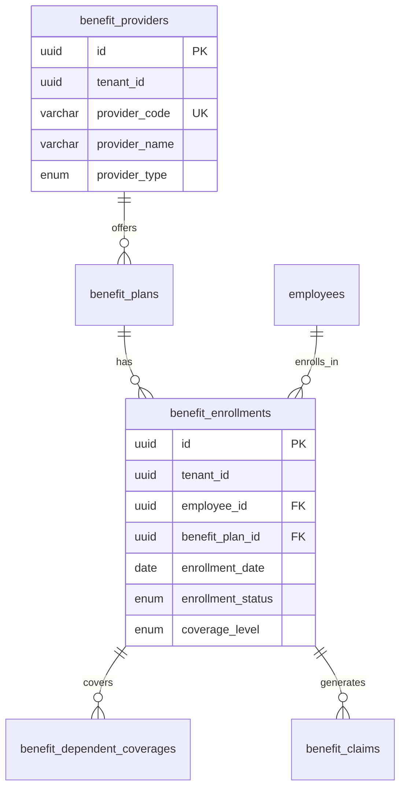

# Implementation Proposal: Legacy HRM Features

**Status:** PROPOSAL
**Priority:** Medium-High
**Effort:** 2-3 weeks
**Risk:** Low (incremental additions to existing schema)

## Overview

This proposal outlines the incremental implementation of 24 missing tables from the legacy `afenda-hybrid` system into the current AFENDA-META-UI codebase. All additions will be made to the existing `hr` schema to avoid breaking changes.

---

## Scope

### In Scope
✅ Add 24 missing tables to `hr` schema
✅ Create new domain files: `benefits.ts`, expand `learning.ts`
✅ Add missing enums to `_enums.ts`
✅ Add Zod schemas for new tables
✅ Update `_relations.ts` with new FKs
✅ Create SCHEMA_DIAGRAM.md with Mermaid ERDs
✅ Add migration for new tables

### Out of Scope
❌ Multi-schema migration (defer to Phase 2)
❌ fundamentals/operations subdirectory split (defer)
❌ API/business logic implementation
❌ Frontend UI for new features

---

## Phase 1: Benefits Domain

**Effort:** 3-4 days
**Files Created:** `packages/db/src/schema/hr/benefits.ts`

### Tables to Add

#### 1. `benefitProviders`
```typescript
// Benefits providers (insurance companies, plan administrators)
export const benefitProviders = hrSchema.table("benefit_providers", {
  id: uuid("id").defaultRandom().primaryKey(),
  tenantId: uuid("tenant_id").notNull(),
  providerCode: varchar("provider_code", { length: 50 }).notNull(),
  providerName: varchar("provider_name", { length: 255 }).notNull(),
  providerType: benefitProviderTypeEnum("provider_type").notNull(), // insurance, retirement, wellness, other
  contactEmail: varchar("contact_email", { length: 255 }),
  contactPhone: varchar("contact_phone", { length: 50 }),
  website: varchar("website", { length: 255 }),
  contractStartDate: date("contract_start_date"),
  contractEndDate: date("contract_end_date"),
  isActive: boolean("is_active").default(true).notNull(),
  ...auditableColumns,
  ...softDeleteColumns,
}, (table) => ({
  pk: primaryKey({ columns: [table.tenantId, table.id] }),
  uniqCode: unique().on(table.tenantId, table.providerCode).where(sql`deleted_at IS NULL`),
  tenantIdIdx: index().on(table.tenantId, table.isActive).where(sql`deleted_at IS NULL`),
}));
```

#### 2. `benefitEnrollments`
```typescript
// Employee enrollment in benefit plans
export const benefitEnrollments = hrSchema.table("benefit_enrollments", {
  id: uuid("id").defaultRandom().primaryKey(),
  tenantId: uuid("tenant_id").notNull(),
  employeeId: uuid("employee_id").notNull(),
  benefitPlanId: uuid("benefit_plan_id").notNull(),
  enrollmentDate: date("enrollment_date").notNull(),
  effectiveDate: date("effective_date").notNull(),
  terminationDate: date("termination_date"),
  enrollmentStatus: enrollmentStatusEnum("enrollment_status").notNull(), // pending, active, cancelled, expired
  coverageLevel: coverageLevelEnum("coverage_level").notNull(), // employee_only, employee_spouse, employee_children, family
  employeeContribution: numeric("employee_contribution", { precision: 12, scale: 2 }),
  employerContribution: numeric("employer_contribution", { precision: 12, scale: 2 }),
  totalCost: numeric("total_cost", { precision: 12, scale: 2 }),
  notes: text("notes"),
  ...auditableColumns,
  ...softDeleteColumns,
}, (table) => ({
  pk: primaryKey({ columns: [table.tenantId, table.id] }),
  employeeIdx: index().on(table.tenantId, table.employeeId, table.enrollmentStatus),
  planIdx: index().on(table.tenantId, table.benefitPlanId),
  statusIdx: index().on(table.tenantId, table.enrollmentStatus, table.effectiveDate),
  fkEmployee: foreignKey({
    columns: [table.tenantId, table.employeeId],
    foreignColumns: [employees.tenantId, employees.id],
  }),
  fkPlan: foreignKey({
    columns: [table.tenantId, table.benefitPlanId],
    foreignColumns: [benefitPlans.tenantId, benefitPlans.id],
  }),
}));
```

#### 3. `benefitDependentCoverages`
```typescript
// Dependent coverage under employee benefits
export const benefitDependentCoverages = hrSchema.table("benefit_dependent_coverages", {
  id: uuid("id").defaultRandom().primaryKey(),
  tenantId: uuid("tenant_id").notNull(),
  enrollmentId: uuid("enrollment_id").notNull(),
  dependentName: varchar("dependent_name", { length: 255 }).notNull(),
  relationship: dependentRelationshipEnum("relationship").notNull(), // spouse, child, parent, domestic_partner, other
  dateOfBirth: date("date_of_birth"),
  gender: genderEnum("gender"),
  isStudent: boolean("is_student").default(false),
  coverageStartDate: date("coverage_start_date").notNull(),
  coverageEndDate: date("coverage_end_date"),
  additionalCost: numeric("additional_cost", { precision: 12, scale: 2 }),
  ...auditableColumns,
  ...softDeleteColumns,
}, (table) => ({
  pk: primaryKey({ columns: [table.tenantId, table.id] }),
  enrollmentIdx: index().on(table.tenantId, table.enrollmentId),
  fkEnrollment: foreignKey({
    columns: [table.tenantId, table.enrollmentId],
    foreignColumns: [benefitEnrollments.tenantId, benefitEnrollments.id],
  }),
}));
```

#### 4. `benefitClaims`
```typescript
// Benefit claims (medical, insurance, etc.)
export const benefitClaims = hrSchema.table("benefit_claims", {
  id: uuid("id").defaultRandom().primaryKey(),
  tenantId: uuid("tenant_id").notNull(),
  claimNumber: varchar("claim_number", { length: 50 }).notNull(),
  enrollmentId: uuid("enrollment_id").notNull(),
  claimDate: date("claim_date").notNull(),
  serviceDate: date("service_date"),
  claimType: claimTypeEnum("claim_type").notNull(), // medical, dental, vision, disability, life, other
  claimAmount: numeric("claim_amount", { precision: 12, scale: 2 }).notNull(),
  approvedAmount: numeric("approved_amount", { precision: 12, scale: 2 }),
  claimStatus: claimStatusEnum("claim_status").notNull(), // submitted, under_review, approved, rejected, paid
  rejectionReason: text("rejection_reason"),
  reviewedBy: uuid("reviewed_by"),
  reviewedAt: timestamp("reviewed_at", { withTimezone: true }),
  paymentDate: date("payment_date"),
  notes: text("notes"),
  ...auditableColumns,
  ...softDeleteColumns,
}, (table) => ({
  pk: primaryKey({ columns: [table.tenantId, table.id] }),
  uniqClaimNumber: unique().on(table.tenantId, table.claimNumber).where(sql`deleted_at IS NULL`),
  enrollmentIdx: index().on(table.tenantId, table.enrollmentId),
  statusIdx: index().on(table.tenantId, table.claimStatus, table.claimDate),
  reviewerIdx: index().on(table.tenantId, table.reviewedBy).where(sql`reviewed_by IS NOT NULL`),
  fkEnrollment: foreignKey({
    columns: [table.tenantId, table.enrollmentId],
    foreignColumns: [benefitEnrollments.tenantId, benefitEnrollments.id],
  }),
  // reviewedBy FK deferred — see CIRCULAR_FKS.md
}));
```

### New Enums

```typescript
export const benefitProviderTypeEnum = hrSchema.enum("benefit_provider_type", [
  "insurance",
  "retirement",
  "wellness",
  "other",
]);

export const enrollmentStatusEnum = hrSchema.enum("enrollment_status", [
  "pending",
  "active",
  "cancelled",
  "expired",
]);

export const coverageLevelEnum = hrSchema.enum("coverage_level", [
  "employee_only",
  "employee_spouse",
  "employee_children",
  "family",
]);

export const dependentRelationshipEnum = hrSchema.enum("dependent_relationship", [
  "spouse",
  "child",
  "parent",
  "domestic_partner",
  "other",
]);

export const claimTypeEnum = hrSchema.enum("claim_type", [
  "medical",
  "dental",
  "vision",
  "disability",
  "life",
  "other",
]);

export const claimStatusEnum = hrSchema.enum("claim_status", [
  "submitted",
  "under_review",
  "approved",
  "rejected",
  "paid",
]);
```

### Zod Schemas

Add to `_zodShared.ts`:

```typescript
// Benefits domain
export const benefitProviderIdSchema = z.string().uuid().brand("BenefitProviderId");
export const enrollmentIdSchema = z.string().uuid().brand("EnrollmentId");
export const dependentCoverageIdSchema = z.string().uuid().brand("DependentCoverageId");
export const claimIdSchema = z.string().uuid().brand("ClaimId");

// Cross-field refinements
export function refineCoverageEndAfterStart<T extends { coverageStartDate: Date | null; coverageEndDate?: Date | null }>(
  message = "Coverage end date must be on or after start date"
) {
  return (data: T) => {
    if (!data.coverageEndDate || !data.coverageStartDate) return true;
    return data.coverageEndDate >= data.coverageStartDate;
  };
}

export function refineClaimAmountPositive(field: string, message?: string) {
  return refinement.refine(
    (val) => val.claimAmount >= 0,
    { message: message ?? `${field} must be non-negative`, path: [field] }
  );
}
```

---

## Phase 2: Learning Domain Enhancement

**Effort:** 5-6 days
**Files Modified:** Rename `training.ts` → `learning.ts`

### Tables to Add (11 total)

**Master Data (fundamentals):**
1. `courses` — Course catalog
2. `courseModules` — Module breakdown
3. `learningPaths` — Career development paths
4. `assessments` — Assessment definitions

**Operations:**
5. `courseSessions` — Scheduled sessions
6. `courseEnrollments` — Student enrollments
7. `learningPathAssignments` — Assigned paths
8. `learningPathProgress` — Per-course progress
9. `certificationAwards` — Issued certificates
10. `courseFeedback` — Post-training feedback
11. `trainingCosts` — Expense tracking

### Key Tables Detail

#### `courses`
```typescript
export const courses = hrSchema.table("courses", {
  id: uuid("id").defaultRandom().primaryKey(),
  tenantId: uuid("tenant_id").notNull(),
  courseCode: varchar("course_code", { length: 50 }).notNull(),
  courseName: varchar("course_name", { length: 255 }).notNull(),
  courseType: courseTypeEnum("course_type").notNull(), // technical, soft_skills, compliance, leadership, etc.
  description: text("description"),
  durationHours: numeric("duration_hours", { precision: 6, scale: 2 }),
  maxParticipants: integer("max_participants"),
  certificateIssued: boolean("certificate_issued").default(false),
  isActive: boolean("is_active").default(true).notNull(),
  ...auditableColumns,
  ...softDeleteColumns,
}, (table) => ({
  pk: primaryKey({ columns: [table.tenantId, table.id] }),
  uniqCode: unique().on(table.tenantId, table.courseCode).where(sql`deleted_at IS NULL`),
  tenantIdIdx: index().on(table.tenantId, table.isActive),
}));
```

#### `courseEnrollments`
```typescript
export const courseEnrollments = hrSchema.table("course_enrollments", {
  id: uuid("id").defaultRandom().primaryKey(),
  tenantId: uuid("tenant_id").notNull(),
  employeeId: uuid("employee_id").notNull(),
  courseId: uuid("course_id").notNull(),
  sessionId: uuid("session_id"), // NULL for sessionless enrollments
  enrollmentDate: date("enrollment_date").notNull(),
  enrollmentStatus: enrollmentStatusEnum("enrollment_status").notNull(),
  completionDate: date("completion_date"),
  score: numeric("score", { precision: 5, scale: 2 }),
  passed: boolean("passed"),
  certificateIssued: boolean("certificate_issued").default(false),
  ...auditableColumns,
  ...softDeleteColumns,
}, (table) => ({
  pk: primaryKey({ columns: [table.tenantId, table.id] }),
  employeeIdx: index().on(table.tenantId, table.employeeId, table.enrollmentStatus),
  courseIdx: index().on(table.tenantId, table.courseId),
  sessionIdx: index().on(table.tenantId, table.sessionId).where(sql`session_id IS NOT NULL`),
  fkEmployee: foreignKey({
    columns: [table.tenantId, table.employeeId],
    foreignColumns: [employees.tenantId, employees.id],
  }),
  fkCourse: foreignKey({
    columns: [table.tenantId, table.courseId],
    foreignColumns: [courses.tenantId, courses.id],
  }),
}));
```

*(See LEGACY-COMPARISON-ANALYSIS.md for full list of 11 tables)*

---

## Phase 3: Payroll Domain Enhancement

**Effort:** 3-4 days
**Files Modified:** `payroll.ts`

### Tables to Add (5 total)

1. **`taxBrackets`** — Tax calculation rules per jurisdiction
2. **`statutoryDeductions`** — Mandatory deductions (CPF, EPF, Social Security)
3. **`payrollAdjustments`** — Manual pay adjustments (bonuses, corrections)
4. **`payslips`** — Payslip metadata and PDF storage
5. **`paymentDistributions`** — Bank transfer records

### Key Table Detail

#### `payrollAdjustments`
```typescript
export const payrollAdjustments = hrSchema.table("payroll_adjustments", {
  id: uuid("id").defaultRandom().primaryKey(),
  tenantId: uuid("tenant_id").notNull(),
  payrollEntryId: uuid("payroll_entry_id").notNull(),
  adjustmentType: adjustmentTypeEnum("adjustment_type").notNull(), // bonus, correction, backpay, deduction, other
  amount: numeric("amount", { precision: 12, scale: 2 }).notNull(),
  reason: text("reason"),
  approvedBy: uuid("approved_by"),
  approvedAt: timestamp("approved_at", { withTimezone: true }),
  ...auditableColumns,
  ...softDeleteColumns,
}, (table) => ({
  pk: primaryKey({ columns: [table.tenantId, table.id] }),
  entryIdx: index().on(table.tenantId, table.payrollEntryId),
  approverIdx: index().on(table.tenantId, table.approvedBy).where(sql`approved_by IS NOT NULL`),
  fkEntry: foreignKey({
    columns: [table.tenantId, table.payrollEntryId],
    foreignColumns: [payrollEntries.tenantId, payrollEntries.id],
  }),
}));
```

---

## Phase 4: Recruitment Domain Enhancement

**Effort:** 2-3 days
**Files Modified:** `recruitment.ts`

### Tables to Add (3 total)

1. **`applicantDocuments`** — Resume/CV/certificate attachments
2. **`interviewFeedback`** — Structured interview evaluations
3. **`offerLetters`** — Job offer generation and acceptance tracking

### Key Table Detail

#### `offerLetters`
```typescript
export const offerLetters = hrSchema.table("offer_letters", {
  id: uuid("id").defaultRandom().primaryKey(),
  tenantId: uuid("tenant_id").notNull(),
  applicationId: uuid("application_id").notNull(),
  offerDate: date("offer_date").notNull(),
  expiryDate: date("expiry_date"),
  jobTitle: varchar("job_title", { length: 255 }).notNull(),
  salaryAmount: numeric("salary_amount", { precision: 12, scale: 2 }).notNull(),
  currencyCode: varchar("currency_code", { length: 3 }).notNull(),
  startDate: date("start_date"),
  offerStatus: offerStatusEnum("offer_status").notNull(), // draft, sent, accepted, declined, withdrawn, expired
  acceptedAt: timestamp("accepted_at", { withTimezone: true }),
  declinedReason: text("declined_reason"),
  documentUrl: varchar("document_url", { length: 500 }),
  ...auditableColumns,
  ...softDeleteColumns,
}, (table) => ({
  pk: primaryKey({ columns: [table.tenantId, table.id] }),
  applicationIdx: index().on(table.tenantId, table.applicationId),
  statusIdx: index().on(table.tenantId, table.offerStatus, table.offerDate),
  fkApplication: foreignKey({
    columns: [table.tenantId, table.applicationId],
    foreignColumns: [jobApplications.tenantId, jobApplications.id],
  }),
}));
```

---

## Phase 5: Documentation & Diagrams

**Effort:** 2 days

### Create SCHEMA_DIAGRAM.md

Add Mermaid ERD for each domain:

```markdown
# HR Schema Diagrams

## Benefits Domain


\`\`\`

*(Add diagrams for each domain)*

---

## Implementation Checklist

### Pre-Implementation
- [ ] Review with architecture team
- [ ] Prioritize which domains are MVP-critical
- [ ] Database backup plan
- [ ] Rollback strategy

### Phase 1: Benefits (Days 1-4)
- [ ] Create `benefits.ts` with 4 tables
- [ ] Add 6 new enums to `_enums.ts`
- [ ] Add Zod schemas to `_zodShared.ts`
- [ ] Update `_relations.ts`
- [ ] Update `index.ts` barrel exports
- [ ] Generate migration: `pnpm drizzle-kit generate --name add_benefits_domain`
- [ ] Run tests
- [ ] Update README.md with benefits tables

### Phase 2: Learning (Days 5-10)
- [ ] Rename `training.ts` → `learning.ts`
- [ ] Add 11 learning tables
- [ ] Add learning enums
- [ ] Add comprehensive Zod schemas (reference legacy 29.8KB patterns)
- [ ] Update relations
- [ ] Generate migration: `pnpm drizzle-kit generate --name enhance_learning_domain`
- [ ] Run tests
- [ ] Update README.md

### Phase 3: Payroll (Days 11-14)
- [ ] Add 5 payroll tables to `payroll.ts`
- [ ] Add payroll enums
- [ ] Add Zod schemas
- [ ] Update relations
- [ ] Generate migration: `pnpm drizzle-kit generate --name enhance_payroll_domain`
- [ ] Run tests
- [ ] Update README.md

### Phase 4: Recruitment (Days 15-17)
- [ ] Add 3 recruitment tables to `recruitment.ts`
- [ ] Add recruitment enums
- [ ] Add Zod schemas
- [ ] Update relations
- [ ] Generate migration: `pnpm drizzle-kit generate --name enhance_recruitment_domain`
- [ ] Run tests
- [ ] Update README.md

### Phase 5: Documentation (Days 18-19)
- [ ] Create SCHEMA_DIAGRAM.md with Mermaid ERDs
- [ ] Update CIRCULAR_FKS.md if new circular FKs discovered
- [ ] Update CUSTOM_SQL_REGISTRY.json if needed
- [ ] Create ADR-003 documenting legacy feature adoption rationale

### Phase 6: Final Review (Day 20)
- [ ] Run full test suite
- [ ] Check TypeScript compilation
- [ ] Verify migration safety
- [ ] Code review
- [ ] Deploy to staging
- [ ] Smoke test all new tables

---

## Migration Safety

### Risk Mitigation
1. **Incremental Migrations** — Each phase generates separate migration
2. **No Schema Changes** — All additions to existing `hr` schema (no breaking changes)
3. **Nullable FKs Initially** — Can add FK constraints in later phases if needed
4. **Soft-Delete Safe** — All new tables follow existing soft-delete pattern
5. **Tenant Isolation** — All new tables include `tenantId` with composite indexes

### Rollback Plan
- Each migration is reversible via Drizzle's `down` migrations
- No data loss risk (only added tables, no modifications)
- Can deploy phases independently

---

## Success Criteria

### Technical
- ✅ 24 new tables added successfully
- ✅ All migrations apply cleanly
- ✅ TypeScript compiles without errors
- ✅ All FK relationships declared or documented
- ✅ Zod schemas cover all new tables
- ✅ Relations catalog updated
- ✅ Test coverage for new schemas

### Documentation
- ✅ SCHEMA_DIAGRAM.md created
- ✅ README.md updated with new tables
- ✅ ADR-003 documents rationale
- ✅ CIRCULAR_FKS.md updated if needed

### Business Value
- ✅ Benefits domain ready for dependent coverage and claims
- ✅ Learning domain ready for full LMS implementation
- ✅ Payroll ready for statutory compliance
- ✅ Recruitment ready for offer letter generation

---

## Deferred to Phase 2

The following architectural changes are OUT OF SCOPE for this proposal:

❌ **Multi-Schema Migration** — Moving tables to separate `benefits`, `learning`, `payroll`, `recruitment`, `talent` schemas (6-8 weeks effort)
❌ **fundamentals/operations Subdirectories** — Reorganizing files into subdirs (cosmetic, low business value)
❌ **Domain-Scoped _shared/ Helpers** — Not critical for functionality
❌ **API Implementation** — Backend services for new tables (separate epic)
❌ **Frontend UI** — User interfaces for new features (separate epic)

---

## Next Steps

1. **Review this proposal** with product and architecture teams
2. **Prioritize domains** — Which of Benefits/Learning/Payroll/Recruitment is MVP-critical?
3. **Allocate developer time** — 2-3 week sprint
4. **Create Jira tickets** — One per phase
5. **Begin implementation** — Start with highest-priority domain

---

**Questions?** Tag @architecture or @database-team in Slack.
