# HR Schema Diagrams

**Date:** 2026-03-30
**Version:** 2.3
**Domains:** Core six (People, Benefits, Learning, Payroll, Recruitment, Attendance) plus operational modules documented in `HR_SCHEMA_UPGRADE_GUIDE.md` (ESS, expenses, skills, analytics, workforce strategy, global workforce, grievances, loans, policies, engagement, tax, travel, and others).

**Note:** This diagram set mirrors the domain-oriented organization described in `../README.md`. Each ERD groups tables by business domain even if the underlying SQL creation order differs. Naming conventions (`hr.` prefix, lower_snake_case tables/columns, tenant-scoped UUID PKs) are consistently applied, so new diagrams or modules should follow the same pattern. **Machine-checked edges:** the in-code relation catalog (`_relations.ts`) is diffed against Drizzle `foreignKey()` by `pnpm ci:gate:schema-quality` — see **Relations catalog & drift gate** (section below).

---

## Overview

This document contains Entity Relationship Diagrams (ERDs) for all HR domains using Mermaid syntax. Each diagram shows the relationships between tables, primary keys (PK), foreign keys (FK), and important constraints.

---

## Relations catalog & drift gate

ERDs here are **authoring / navigation** artifacts. The **canonical physical FK graph** for CI is whatever `foreignKey({ ... })` declarations appear in `packages/db/src/schema/hr/*.ts`. The parallel **`hrRelations`** map in `_relations.ts` documents the same edges in a stable, grep-friendly form (and supports docs / reverse engineering).

- **Gate:** From the repo root, run `pnpm ci:gate:schema-quality`. Rule **`RELATIONS_DRIFT`** (severity **error**) fails when a catalog entry disagrees with an extracted FK edge, or when the schema declares an FK in scope that has no matching catalog row.
- **Scope:** Single-column FKs plus composite second legs where the parent key is `[tenantId, id]` (including **self-table** patterns such as `course_modules.prerequisite_module_id` → `course_modules.id`). Other composite shapes are listed in `tools/ci-gate/drizzle-schema-quality/LIMITATIONS.md`.
- **Remediation:** `RELATIONS_DRIFT_REMEDIATION.md`. **Upgrade cadence:** `HR_SCHEMA_UPGRADE_GUIDE.md`.

When you add or rename a relationship in a diagram, update **`_relations.ts`** (and the Drizzle FK) so the gate stays green; diagrams do not substitute for the catalog.

---

## People Domain ERD

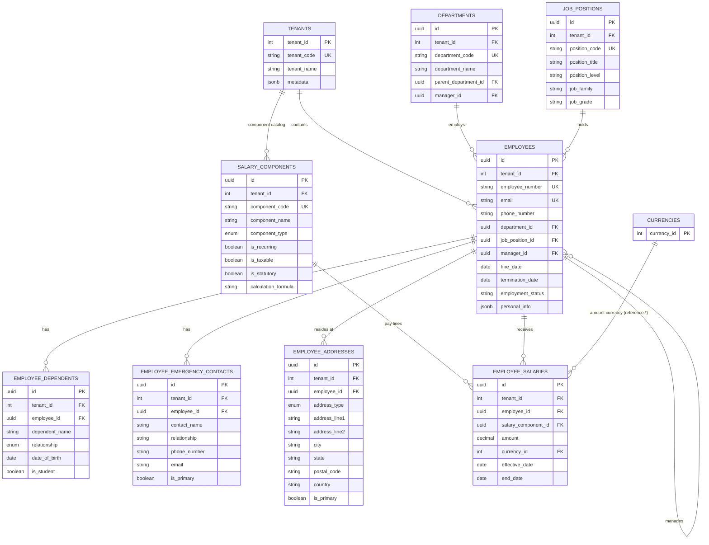
```mermaid
erDiagram
    TENANTS ||--o{ EMPLOYEES : "contains"
    DEPARTMENTS ||--o{ EMPLOYEES : "employs"
    JOB_POSITIONS ||--o{ EMPLOYEES : "holds"
    EMPLOYEES ||--o{ EMPLOYEES : "manages"
    EMPLOYEES ||--o{ EMPLOYEE_DEPENDENTS : "has"
    EMPLOYEES ||--o{ EMPLOYEE_EMERGENCY_CONTACTS : "has"
    EMPLOYEES ||--o{ EMPLOYEE_ADDRESSES : "resides at"
    TENANTS ||--o{ SALARY_COMPONENTS : "component catalog"
    SALARY_COMPONENTS ||--o{ EMPLOYEE_SALARIES : "pay lines"
    EMPLOYEES ||--o{ EMPLOYEE_SALARIES : "receives"
    CURRENCIES ||--o{ EMPLOYEE_SALARIES : "amount currency (reference.*)"

    TENANTS {
        int tenant_id PK
        string tenant_code UK
        string tenant_name
        jsonb metadata
    }

    DEPARTMENTS {
        uuid id PK
        int tenant_id FK
        string department_code UK
        string department_name
        uuid parent_department_id FK
        uuid manager_id FK
    }

    JOB_POSITIONS {
        uuid id PK
        int tenant_id FK
        string position_code UK
        string position_title
        string position_level
        string job_family
        string job_grade
    }

    EMPLOYEES {
        uuid id PK
        int tenant_id FK
        string employee_number UK
        string email UK
        string phone_number
        uuid department_id FK
        uuid job_position_id FK
        uuid manager_id FK
        date hire_date
        date termination_date
        string employment_status
        jsonb personal_info
    }

    EMPLOYEE_DEPENDENTS {
        uuid id PK
        int tenant_id FK
        uuid employee_id FK
        string dependent_name
        enum relationship
        date date_of_birth
        boolean is_student
    }

    EMPLOYEE_EMERGENCY_CONTACTS {
        uuid id PK
        int tenant_id FK
        uuid employee_id FK
        string contact_name
        string relationship
        string phone_number
        string email
        boolean is_primary
    }

    EMPLOYEE_ADDRESSES {
        uuid id PK
        int tenant_id FK
        uuid employee_id FK
        enum address_type
        string address_line1
        string address_line2
        string city
        string state
        string postal_code
        string country
        boolean is_primary
    }

    SALARY_COMPONENTS {
        uuid id PK
        int tenant_id FK
        string component_code UK
        string component_name
        enum component_type
        boolean is_recurring
        boolean is_taxable
        boolean is_statutory
        string calculation_formula
    }

    CURRENCIES {
        int currency_id PK
    }

    EMPLOYEE_SALARIES {
        uuid id PK
        int tenant_id FK
        uuid employee_id FK
        uuid salary_component_id FK
        decimal amount
        int currency_id FK
        date effective_date
        date end_date
    }
```

---

## Benefits Domain ERD

Provider-centric model from `benefits.ts` (distinct from **legacy** `employment.benefit_plans` / `employee_benefits` — see `HR_SCHEMA_UPGRADE_GUIDE.md`).

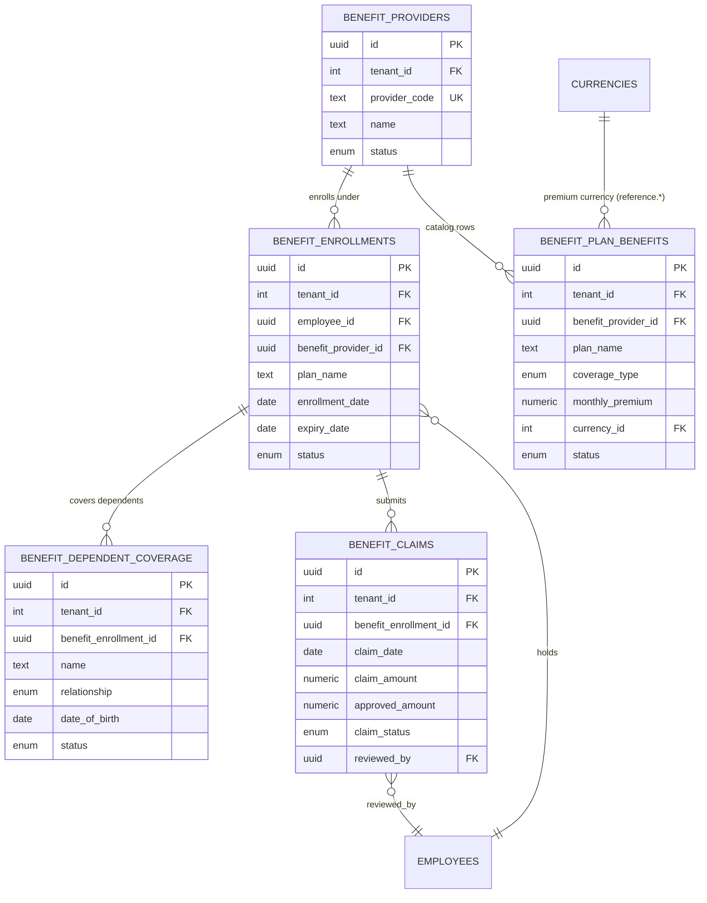
```mermaid
erDiagram
    BENEFIT_PROVIDERS ||--o{ BENEFIT_ENROLLMENTS : "enrolls under"
    EMPLOYEES ||--o{ BENEFIT_ENROLLMENTS : "holds"
    BENEFIT_ENROLLMENTS ||--o{ BENEFIT_DEPENDENT_COVERAGE : "covers dependents"
    BENEFIT_ENROLLMENTS ||--o{ BENEFIT_CLAIMS : "submits"
    BENEFIT_PROVIDERS ||--o{ BENEFIT_PLAN_BENEFITS : "catalog rows"
    BENEFIT_CLAIMS }o--|| EMPLOYEES : "reviewed_by"
    CURRENCIES ||--o{ BENEFIT_PLAN_BENEFITS : "premium currency (reference.*)"

    BENEFIT_PROVIDERS {
        uuid id PK
        int tenant_id FK
        text provider_code UK
        text name
        enum status
    }

    BENEFIT_ENROLLMENTS {
        uuid id PK
        int tenant_id FK
        uuid employee_id FK
        uuid benefit_provider_id FK
        text plan_name
        date enrollment_date
        date expiry_date
        enum status
    }

    BENEFIT_DEPENDENT_COVERAGE {
        uuid id PK
        int tenant_id FK
        uuid benefit_enrollment_id FK
        text name
        enum relationship
        date date_of_birth
        enum status
    }

    BENEFIT_CLAIMS {
        uuid id PK
        int tenant_id FK
        uuid benefit_enrollment_id FK
        date claim_date
        numeric claim_amount
        numeric approved_amount
        enum claim_status
        uuid reviewed_by FK
    }

    BENEFIT_PLAN_BENEFITS {
        uuid id PK
        int tenant_id FK
        uuid benefit_provider_id FK
        text plan_name
        enum coverage_type
        numeric monthly_premium
        int currency_id FK
        enum status
    }
```

---

## Learning Domain ERD

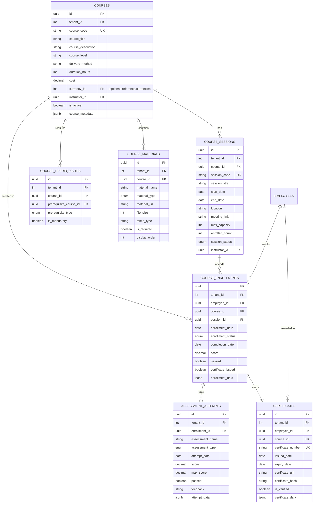
```mermaid
erDiagram
    COURSES ||--o{ COURSE_SESSIONS : "has"
    COURSES ||--o{ COURSE_ENROLLMENTS : "enrolled in"
    COURSE_SESSIONS ||--o{ COURSE_ENROLLMENTS : "attends"
    COURSES ||--o{ COURSE_PREREQUISITES : "requires"
    COURSES ||--o{ COURSE_MATERIALS : "contains"
    COURSE_ENROLLMENTS ||--o{ ASSESSMENT_ATTEMPTS : "takes"
    COURSE_ENROLLMENTS ||--|| CERTIFICATES : "earns"
    EMPLOYEES ||--o{ COURSE_ENROLLMENTS : "enrolls"
    EMPLOYEES ||--o{ CERTIFICATES : "awarded to"

    COURSES {
        uuid id PK
        int tenant_id FK
        string course_code UK
        string course_title
        string course_description
        string course_level
        string delivery_method
        int duration_hours
        decimal cost
        int currency_id FK "optional; reference.currencies"
        uuid instructor_id FK
        boolean is_active
        jsonb course_metadata
    }

    COURSE_SESSIONS {
        uuid id PK
        int tenant_id FK
        uuid course_id FK
        string session_code UK
        string session_title
        date start_date
        date end_date
        string location
        string meeting_link
        int max_capacity
        int enrolled_count
        enum session_status
        uuid instructor_id FK
    }

    COURSE_ENROLLMENTS {
        uuid id PK
        int tenant_id FK
        uuid employee_id FK
        uuid course_id FK
        uuid session_id FK
        date enrollment_date
        enum enrollment_status
        date completion_date
        decimal score
        boolean passed
        boolean certificate_issued
        jsonb enrollment_data
    }

    COURSE_PREREQUISITES {
        uuid id PK
        int tenant_id FK
        uuid course_id FK
        uuid prerequisite_course_id FK
        enum prerequisite_type
        boolean is_mandatory
    }

    COURSE_MATERIALS {
        uuid id PK
        int tenant_id FK
        uuid course_id FK
        string material_name
        enum material_type
        string material_url
        int file_size
        string mime_type
        boolean is_required
        int display_order
    }

    ASSESSMENT_ATTEMPTS {
        uuid id PK
        int tenant_id FK
        uuid enrollment_id FK
        string assessment_name
        enum assessment_type
        date attempt_date
        decimal score
        decimal max_score
        boolean passed
        string feedback
        jsonb attempt_data
    }

    CERTIFICATES {
        uuid id PK
        int tenant_id FK
        uuid employee_id FK
        uuid course_id FK
        string certificate_number UK
        date issued_date
        date expiry_date
        string certificate_url
        string certificate_hash
        boolean is_verified
        jsonb certificate_data
    }
```

---

## Payroll Domain ERD

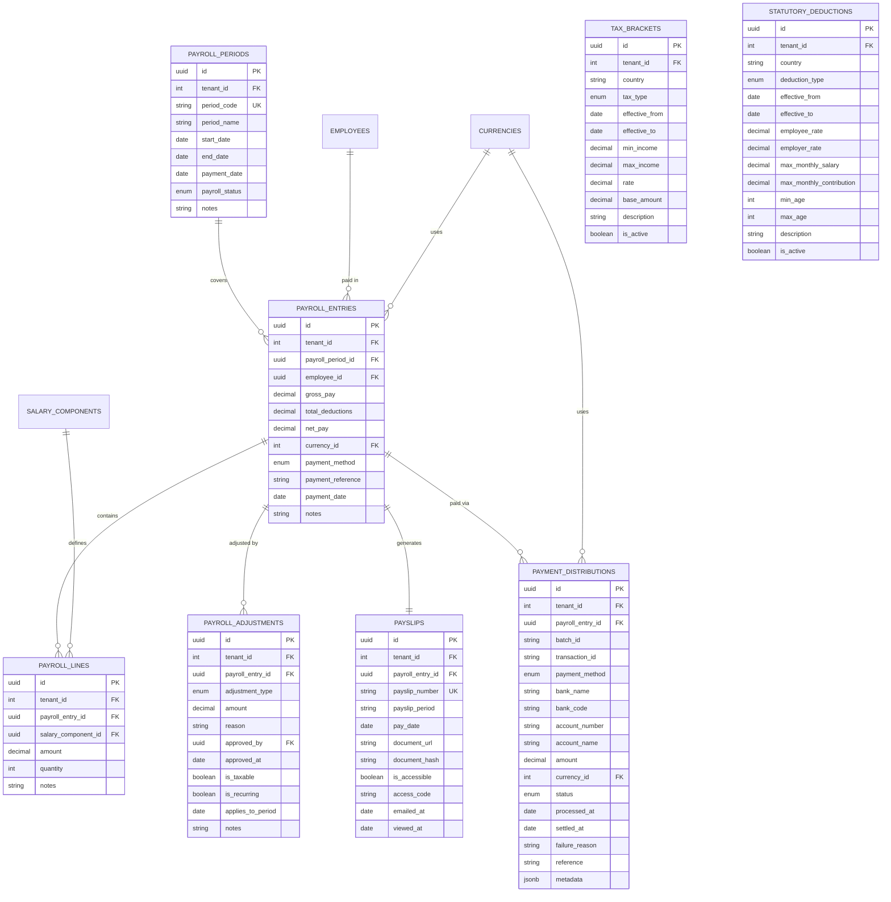
```mermaid
erDiagram
    PAYROLL_PERIODS ||--o{ PAYROLL_ENTRIES : "covers"
    EMPLOYEES ||--o{ PAYROLL_ENTRIES : "paid in"
    PAYROLL_ENTRIES ||--o{ PAYROLL_LINES : "contains"
    SALARY_COMPONENTS ||--o{ PAYROLL_LINES : "defines"
    PAYROLL_ENTRIES ||--o{ PAYROLL_ADJUSTMENTS : "adjusted by"
    PAYROLL_ENTRIES ||--|| PAYSLIPS : "generates"
    PAYROLL_ENTRIES ||--o{ PAYMENT_DISTRIBUTIONS : "paid via"
    CURRENCIES ||--o{ PAYROLL_ENTRIES : "uses"
    CURRENCIES ||--o{ PAYMENT_DISTRIBUTIONS : "uses"

    PAYROLL_PERIODS {
        uuid id PK
        int tenant_id FK
        string period_code UK
        string period_name
        date start_date
        date end_date
        date payment_date
        enum payroll_status
        string notes
    }

    PAYROLL_ENTRIES {
        uuid id PK
        int tenant_id FK
        uuid payroll_period_id FK
        uuid employee_id FK
        decimal gross_pay
        decimal total_deductions
        decimal net_pay
        int currency_id FK
        enum payment_method
        string payment_reference
        date payment_date
        string notes
    }

    PAYROLL_LINES {
        uuid id PK
        int tenant_id FK
        uuid payroll_entry_id FK
        uuid salary_component_id FK
        decimal amount
        int quantity
        string notes
    }

    PAYROLL_ADJUSTMENTS {
        uuid id PK
        int tenant_id FK
        uuid payroll_entry_id FK
        enum adjustment_type
        decimal amount
        string reason
        uuid approved_by FK
        date approved_at
        boolean is_taxable
        boolean is_recurring
        date applies_to_period
        string notes
    }

    PAYSLIPS {
        uuid id PK
        int tenant_id FK
        uuid payroll_entry_id FK
        string payslip_number UK
        string payslip_period
        date pay_date
        string document_url
        string document_hash
        boolean is_accessible
        string access_code
        date emailed_at
        date viewed_at
    }

    PAYMENT_DISTRIBUTIONS {
        uuid id PK
        int tenant_id FK
        uuid payroll_entry_id FK
        string batch_id
        string transaction_id
        enum payment_method
        string bank_name
        string bank_code
        string account_number
        string account_name
        decimal amount
        int currency_id FK
        enum status
        date processed_at
        date settled_at
        string failure_reason
        string reference
        jsonb metadata
    }

    TAX_BRACKETS {
        uuid id PK
        int tenant_id FK
        string country
        enum tax_type
        date effective_from
        date effective_to
        decimal min_income
        decimal max_income
        decimal rate
        decimal base_amount
        string description
        boolean is_active
    }

    STATUTORY_DEDUCTIONS {
        uuid id PK
        int tenant_id FK
        string country
        enum deduction_type
        date effective_from
        date effective_to
        decimal employee_rate
        decimal employer_rate
        decimal max_monthly_salary
        decimal max_monthly_contribution
        int min_age
        int max_age
        string description
        boolean is_active
    }
```

---

## Recruitment Domain ERD

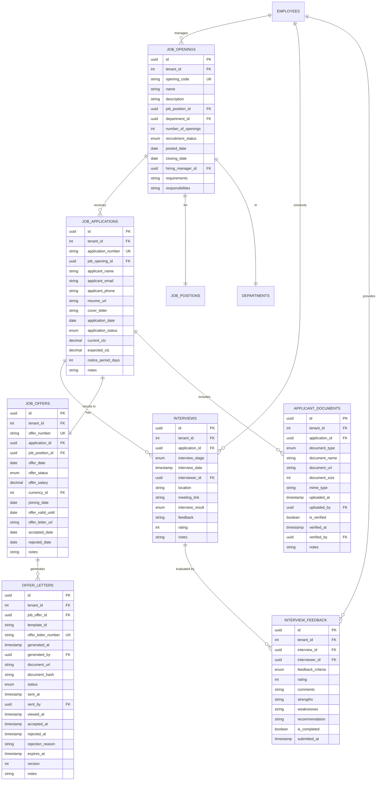
```mermaid
erDiagram
    JOB_OPENINGS ||--o{ JOB_APPLICATIONS : "receives"
    JOB_OPENINGS ||--|| JOB_POSITIONS : "for"
    JOB_OPENINGS ||--|| DEPARTMENTS : "in"
    EMPLOYEES ||--o{ JOB_OPENINGS : "manages"
    JOB_APPLICATIONS ||--o{ INTERVIEWS : "has"
    JOB_APPLICATIONS ||--|| JOB_OFFERS : "results in"
    INTERVIEWS ||--o{ INTERVIEW_FEEDBACK : "evaluated by"
    EMPLOYEES ||--o{ INTERVIEWS : "conducts"
    EMPLOYEES ||--o{ INTERVIEW_FEEDBACK : "provides"
    JOB_OFFERS ||--o{ OFFER_LETTERS : "generates"
    JOB_APPLICATIONS ||--o{ APPLICANT_DOCUMENTS : "includes"

    JOB_OPENINGS {
        uuid id PK
        int tenant_id FK
        string opening_code UK
        string name
        string description
        uuid job_position_id FK
        uuid department_id FK
        int number_of_openings
        enum recruitment_status
        date posted_date
        date closing_date
        uuid hiring_manager_id FK
        string requirements
        string responsibilities
    }

    JOB_APPLICATIONS {
        uuid id PK
        int tenant_id FK
        string application_number UK
        uuid job_opening_id FK
        string applicant_name
        string applicant_email
        string applicant_phone
        string resume_url
        string cover_letter
        date application_date
        enum application_status
        decimal current_ctc
        decimal expected_ctc
        int notice_period_days
        string notes
    }

    INTERVIEWS {
        uuid id PK
        int tenant_id FK
        uuid application_id FK
        enum interview_stage
        timestamp interview_date
        uuid interviewer_id FK
        string location
        string meeting_link
        enum interview_result
        string feedback
        int rating
        string notes
    }

    INTERVIEW_FEEDBACK {
        uuid id PK
        int tenant_id FK
        uuid interview_id FK
        uuid interviewer_id FK
        enum feedback_criteria
        int rating
        string comments
        string strengths
        string weaknesses
        string recommendation
        boolean is_completed
        timestamp submitted_at
    }

    JOB_OFFERS {
        uuid id PK
        int tenant_id FK
        string offer_number UK
        uuid application_id FK
        uuid job_position_id FK
        date offer_date
        enum offer_status
        decimal offer_salary
        int currency_id FK
        date joining_date
        date offer_valid_until
        string offer_letter_url
        date accepted_date
        date rejected_date
        string notes
    }

    OFFER_LETTERS {
        uuid id PK
        int tenant_id FK
        uuid job_offer_id FK
        string template_id
        string offer_letter_number UK
        timestamp generated_at
        uuid generated_by FK
        string document_url
        string document_hash
        enum status
        timestamp sent_at
        uuid sent_by FK
        timestamp viewed_at
        timestamp accepted_at
        timestamp rejected_at
        string rejection_reason
        timestamp expires_at
        int version
        string notes
    }

    APPLICANT_DOCUMENTS {
        uuid id PK
        int tenant_id FK
        uuid application_id FK
        enum document_type
        string document_name
        string document_url
        int document_size
        string mime_type
        timestamp uploaded_at
        uuid uploaded_by FK
        boolean is_verified
        timestamp verified_at
        uuid verified_by FK
        string notes
    }
```

---

## Attendance Domain ERD

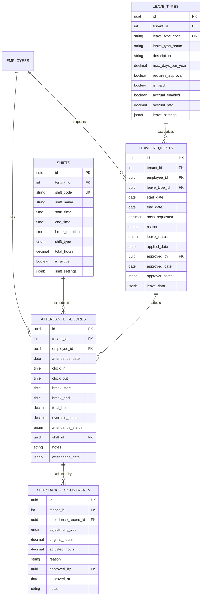
```mermaid
erDiagram
    EMPLOYEES ||--o{ ATTENDANCE_RECORDS : "has"
    ATTENDANCE_RECORDS ||--o{ ATTENDANCE_ADJUSTMENTS : "adjusted by"
    SHIFTS ||--o{ ATTENDANCE_RECORDS : "scheduled in"
    LEAVE_REQUESTS ||--o{ ATTENDANCE_RECORDS : "affects"
    EMPLOYEES ||--o{ LEAVE_REQUESTS : "requests"
    LEAVE_TYPES ||--o{ LEAVE_REQUESTS : "categorizes"

    ATTENDANCE_RECORDS {
        uuid id PK
        int tenant_id FK
        uuid employee_id FK
        date attendance_date
        time clock_in
        time clock_out
        time break_start
        time break_end
        decimal total_hours
        decimal overtime_hours
        enum attendance_status
        uuid shift_id FK
        string notes
        jsonb attendance_data
    }

    ATTENDANCE_ADJUSTMENTS {
        uuid id PK
        int tenant_id FK
        uuid attendance_record_id FK
        enum adjustment_type
        decimal original_hours
        decimal adjusted_hours
        string reason
        uuid approved_by FK
        date approved_at
        string notes
    }

    SHIFTS {
        uuid id PK
        int tenant_id FK
        string shift_code UK
        string shift_name
        time start_time
        time end_time
        time break_duration
        enum shift_type
        decimal total_hours
        boolean is_active
        jsonb shift_settings
    }

    LEAVE_REQUESTS {
        uuid id PK
        int tenant_id FK
        uuid employee_id FK
        uuid leave_type_id FK
        date start_date
        date end_date
        decimal days_requested
        string reason
        enum leave_status
        date applied_date
        uuid approved_by FK
        date approved_date
        string approver_notes
        jsonb leave_data
    }

    LEAVE_TYPES {
        uuid id PK
        int tenant_id FK
        string leave_type_code UK
        string leave_type_name
        string description
        decimal max_days_per_year
        boolean requires_approval
        boolean is_paid
        boolean accrual_enabled
        decimal accrual_rate
        jsonb leave_settings
    }
```

---

## Cross-Domain Relationships

Sketch only — many more edges exist; canonical graph is Drizzle `foreignKey()` + `hrRelations` (HR→HR) via `pnpm ci:gate:schema-quality`.

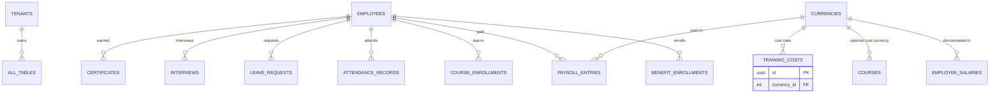
```mermaid
erDiagram
    TENANTS ||--o{ ALL_TABLES : "owns"
    EMPLOYEES ||--o{ BENEFIT_ENROLLMENTS : "enrolls"
    EMPLOYEES ||--o{ COURSE_ENROLLMENTS : "learns"
    EMPLOYEES ||--o{ PAYROLL_ENTRIES : "paid"
    EMPLOYEES ||--o{ ATTENDANCE_RECORDS : "attends"
    EMPLOYEES ||--o{ LEAVE_REQUESTS : "requests"
    EMPLOYEES ||--o{ INTERVIEWS : "interviews"
    EMPLOYEES ||--o{ CERTIFICATES : "earned"
    CURRENCIES ||--o{ EMPLOYEE_SALARIES : "denominated in"
    CURRENCIES ||--o{ COURSES : "optional cost currency"
    CURRENCIES ||--o{ PAYROLL_ENTRIES : "paid in"
    CURRENCIES ||--o{ TRAINING_COSTS : "cost rows"

    TRAINING_COSTS {
        uuid id PK
        int currency_id FK
    }
```

---

## Legend

| Symbol / pattern | Meaning |
| ---------------- | ------- |
| PK / FK / UK | Primary / foreign / unique key (in entity boxes) |
| `A \|\|--o{ B` | One `A` row to many `B` rows |
| `A \|\|--\|\| B` | One-to-one |
| `B }o--\|\| A` | Many `B` rows reference one `A` (typical FK direction) |

---

## Notes

1. **Tenant Isolation**: All tables include `tenant_id` for multi-tenancy
2. **Audit Columns**: Most tables include `created_at`, `updated_at`, `created_by`, `updated_by`
3. **Soft Delete**: Many tables include `deleted_at` for soft deletion
4. **JSONB Fields**: Used for flexible metadata and extensible data storage
5. **Enums**: Used for controlled vocabularies and status tracking

---

## Workflow State Diagrams

### 1. Recruitment Workflow

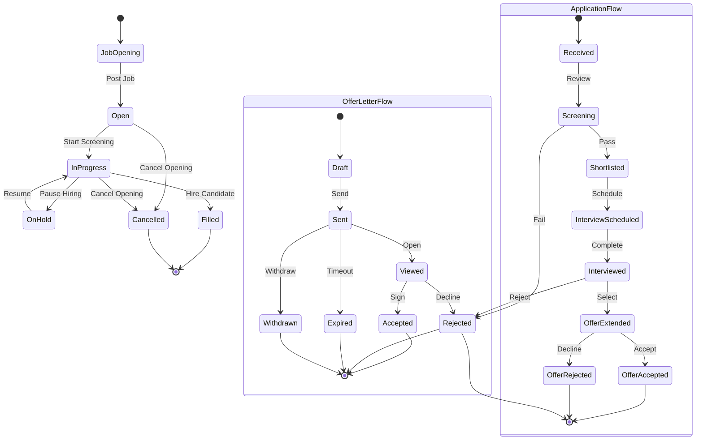
```mermaid
stateDiagram-v2
    [*] --> JobOpening
    JobOpening --> Open : Post Job
    Open --> InProgress : Start Screening
    InProgress --> OnHold : Pause Hiring
    InProgress --> Filled : Hire Candidate
    OnHold --> InProgress : Resume
    Open --> Cancelled : Cancel Opening
    InProgress --> Cancelled : Cancel Opening
    Filled --> [*]
    Cancelled --> [*]

    state ApplicationFlow {
        [*] --> Received
        Received --> Screening : Review
        Screening --> Shortlisted : Pass
        Screening --> Rejected : Fail
        Shortlisted --> InterviewScheduled : Schedule
        InterviewScheduled --> Interviewed : Complete
        Interviewed --> OfferExtended : Select
        Interviewed --> Rejected : Reject
        OfferExtended --> OfferAccepted : Accept
        OfferExtended --> OfferRejected : Decline
        OfferAccepted --> [*]
        OfferRejected --> [*]
        Rejected --> [*]
    }

    state OfferLetterFlow {
        [*] --> Draft
        Draft --> Sent : Send
        Sent --> Viewed : Open
        Viewed --> Accepted : Sign
        Viewed --> Rejected : Decline
        Sent --> Expired : Timeout
        Sent --> Withdrawn : Withdraw
        Accepted --> [*]
        Rejected --> [*]
        Expired --> [*]
        Withdrawn --> [*]
    }
```

### 2. Benefits Enrollment Workflow

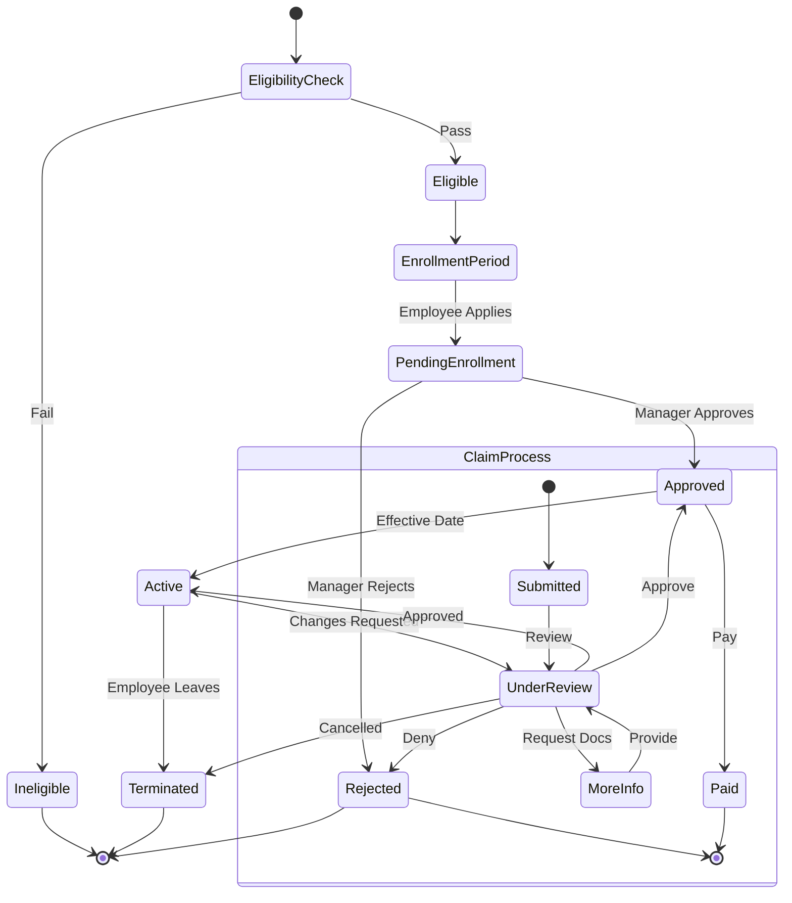
```mermaid
stateDiagram-v2
    [*] --> EligibilityCheck
    EligibilityCheck --> Eligible : Pass
    EligibilityCheck --> Ineligible : Fail
    Ineligible --> [*]

    Eligible --> EnrollmentPeriod
    EnrollmentPeriod --> PendingEnrollment : Employee Applies
    PendingEnrollment --> Approved : Manager Approves
    PendingEnrollment --> Rejected : Manager Rejects
    Rejected --> [*]

    Approved --> Active : Effective Date
    Active --> UnderReview : Changes Requested
    UnderReview --> Active : Approved
    UnderReview --> Terminated : Cancelled

    Active --> Terminated : Employee Leaves
    Terminated --> [*]

    state ClaimProcess {
        [*] --> Submitted
        Submitted --> UnderReview : Review
        UnderReview --> Approved : Approve
        UnderReview --> Rejected : Deny
        UnderReview --> MoreInfo : Request Docs
        MoreInfo --> UnderReview : Provide
        Approved --> Paid : Pay
        Rejected --> [*]
        Paid --> [*]
    }
```

### 3. Payroll Processing Workflow

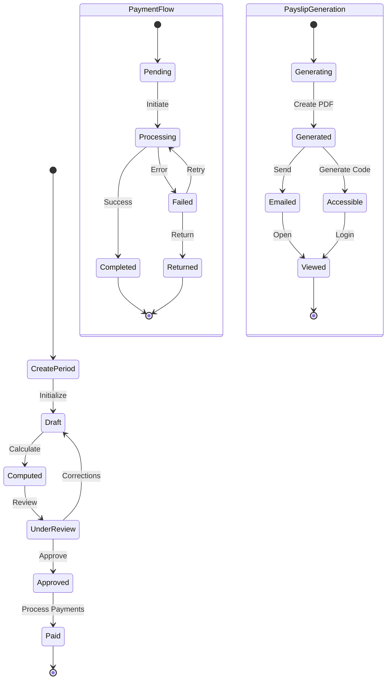
```mermaid
stateDiagram-v2
    [*] --> CreatePeriod
    CreatePeriod --> Draft : Initialize
    Draft --> Computed : Calculate
    Computed --> UnderReview : Review
    UnderReview --> Approved : Approve
    UnderReview --> Draft : Corrections
    Approved --> Paid : Process Payments
    Paid --> [*]

    state PaymentFlow {
        [*] --> Pending
        Pending --> Processing : Initiate
        Processing --> Completed : Success
        Processing --> Failed : Error
        Failed --> Processing : Retry
        Failed --> Returned : Return
        Completed --> [*]
        Returned --> [*]
    }

    state PayslipGeneration {
        [*] --> Generating
        Generating --> Generated : Create PDF
        Generated --> Emailed : Send
        Generated --> Accessible : Generate Code
        Emailed --> Viewed : Open
        Accessible --> Viewed : Login
        Viewed --> [*]
    }
```

---

## Grievance Management ERD

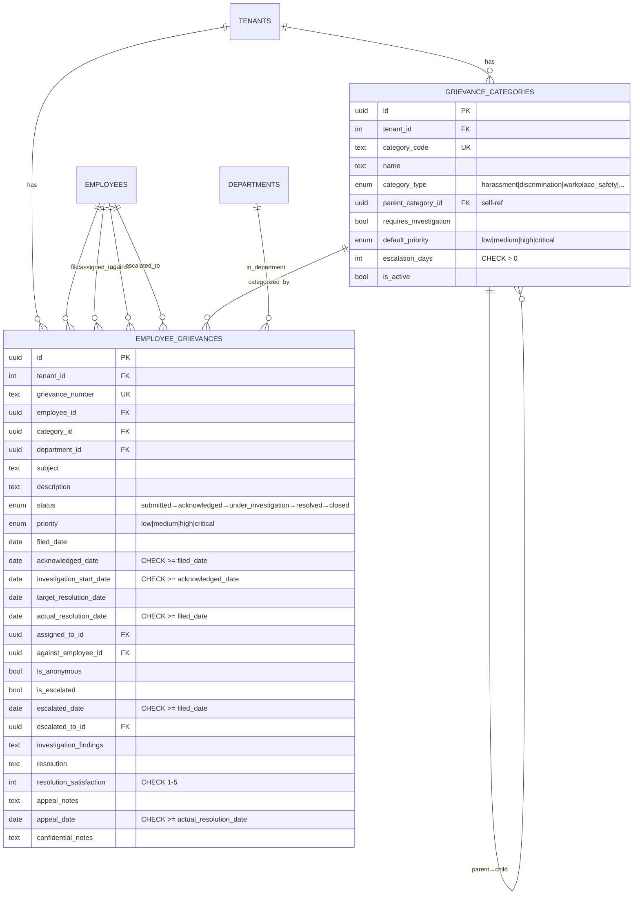
```mermaid
erDiagram
    TENANTS ||--o{ GRIEVANCE_CATEGORIES : has
    GRIEVANCE_CATEGORIES ||--o{ GRIEVANCE_CATEGORIES : "parent→child"
    TENANTS ||--o{ EMPLOYEE_GRIEVANCES : has
    EMPLOYEES ||--o{ EMPLOYEE_GRIEVANCES : "files"
    EMPLOYEES ||--o{ EMPLOYEE_GRIEVANCES : "assigned_to"
    EMPLOYEES ||--o{ EMPLOYEE_GRIEVANCES : "against"
    EMPLOYEES ||--o{ EMPLOYEE_GRIEVANCES : "escalated_to"
    GRIEVANCE_CATEGORIES ||--o{ EMPLOYEE_GRIEVANCES : "categorized_by"
    DEPARTMENTS ||--o{ EMPLOYEE_GRIEVANCES : "in_department"

    GRIEVANCE_CATEGORIES {
        uuid id PK
        int tenant_id FK
        text category_code UK
        text name
        enum category_type "harassment|discrimination|workplace_safety|..."
        uuid parent_category_id FK "self-ref"
        bool requires_investigation
        enum default_priority "low|medium|high|critical"
        int escalation_days "CHECK > 0"
        bool is_active
    }

    EMPLOYEE_GRIEVANCES {
        uuid id PK
        int tenant_id FK
        text grievance_number UK
        uuid employee_id FK
        uuid category_id FK
        uuid department_id FK
        text subject
        text description
        enum status "submitted→acknowledged→under_investigation→resolved→closed"
        enum priority "low|medium|high|critical"
        date filed_date
        date acknowledged_date "CHECK >= filed_date"
        date investigation_start_date "CHECK >= acknowledged_date"
        date target_resolution_date
        date actual_resolution_date "CHECK >= filed_date"
        uuid assigned_to_id FK
        uuid against_employee_id FK
        bool is_anonymous
        bool is_escalated
        date escalated_date "CHECK >= filed_date"
        uuid escalated_to_id FK
        text investigation_findings
        text resolution
        int resolution_satisfaction "CHECK 1-5"
        text appeal_notes
        date appeal_date "CHECK >= actual_resolution_date"
        text confidential_notes
    }
```

## Loan Management ERD

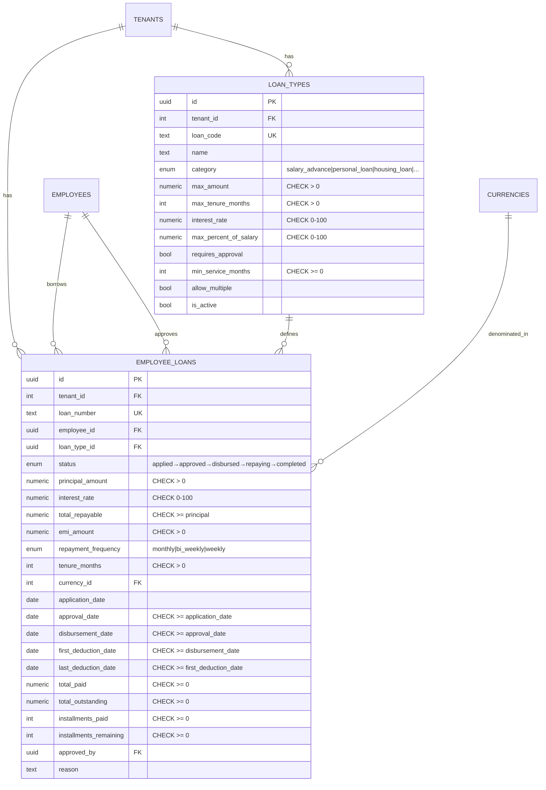
```mermaid
erDiagram
    TENANTS ||--o{ LOAN_TYPES : has
    TENANTS ||--o{ EMPLOYEE_LOANS : has
    EMPLOYEES ||--o{ EMPLOYEE_LOANS : "borrows"
    EMPLOYEES ||--o{ EMPLOYEE_LOANS : "approves"
    LOAN_TYPES ||--o{ EMPLOYEE_LOANS : "defines"
    CURRENCIES ||--o{ EMPLOYEE_LOANS : "denominated_in"

    LOAN_TYPES {
        uuid id PK
        int tenant_id FK
        text loan_code UK
        text name
        enum category "salary_advance|personal_loan|housing_loan|..."
        numeric max_amount "CHECK > 0"
        int max_tenure_months "CHECK > 0"
        numeric interest_rate "CHECK 0-100"
        numeric max_percent_of_salary "CHECK 0-100"
        bool requires_approval
        int min_service_months "CHECK >= 0"
        bool allow_multiple
        bool is_active
    }

    EMPLOYEE_LOANS {
        uuid id PK
        int tenant_id FK
        text loan_number UK
        uuid employee_id FK
        uuid loan_type_id FK
        enum status "applied→approved→disbursed→repaying→completed"
        numeric principal_amount "CHECK > 0"
        numeric interest_rate "CHECK 0-100"
        numeric total_repayable "CHECK >= principal"
        numeric emi_amount "CHECK > 0"
        enum repayment_frequency "monthly|bi_weekly|weekly"
        int tenure_months "CHECK > 0"
        int currency_id FK
        date application_date
        date approval_date "CHECK >= application_date"
        date disbursement_date "CHECK >= approval_date"
        date first_deduction_date "CHECK >= disbursement_date"
        date last_deduction_date "CHECK >= first_deduction_date"
        numeric total_paid "CHECK >= 0"
        numeric total_outstanding "CHECK >= 0"
        int installments_paid "CHECK >= 0"
        int installments_remaining "CHECK >= 0"
        uuid approved_by FK
        text reason
    }
```

## HR policy documents & acknowledgments ERD

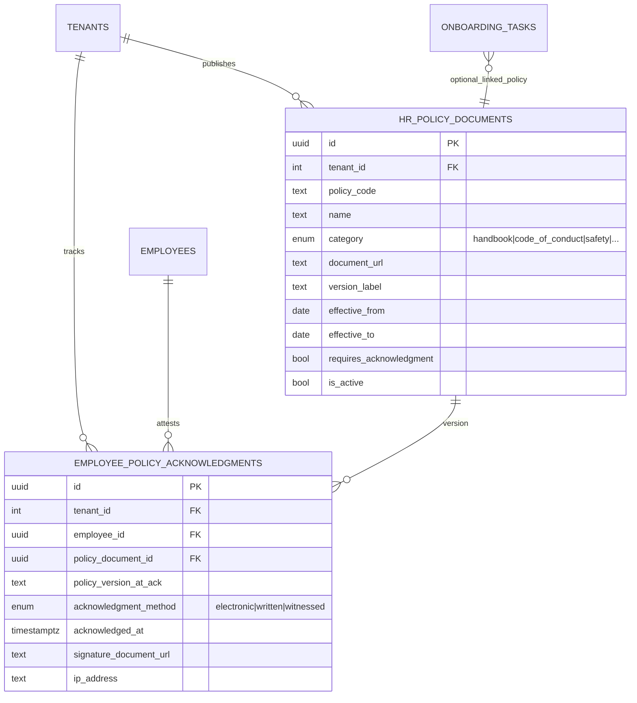
```mermaid
erDiagram
    TENANTS ||--o{ HR_POLICY_DOCUMENTS : publishes
    TENANTS ||--o{ EMPLOYEE_POLICY_ACKNOWLEDGMENTS : tracks
    EMPLOYEES ||--o{ EMPLOYEE_POLICY_ACKNOWLEDGMENTS : attests
    HR_POLICY_DOCUMENTS ||--o{ EMPLOYEE_POLICY_ACKNOWLEDGMENTS : version
    ONBOARDING_TASKS }o--|| HR_POLICY_DOCUMENTS : optional_linked_policy

    HR_POLICY_DOCUMENTS {
        uuid id PK
        int tenant_id FK
        text policy_code
        text name
        enum category "handbook|code_of_conduct|safety|..."
        text document_url
        text version_label
        date effective_from
        date effective_to
        bool requires_acknowledgment
        bool is_active
    }

    EMPLOYEE_POLICY_ACKNOWLEDGMENTS {
        uuid id PK
        int tenant_id FK
        uuid employee_id FK
        uuid policy_document_id FK
        text policy_version_at_ack
        enum acknowledgment_method "electronic|written|witnessed"
        timestamptz acknowledged_at
        text signature_document_url
        text ip_address
    }
```

## Employee self-service (ESS) ERD

`employeeExperience.ts` (17 tables). Behavior and migrations: [ADR-007](./ADR-007-ess-workflow-and-events.md). HR→HR edges are listed under `// Employee experience` in `_relations.ts` (aggregate `amended_from_request_id` is a **composite** self-FK in SQL — not expanded in the drift gate; see `LIMITATIONS.md`).

```mermaid
erDiagram
    EMPLOYEES ||--o| EMPLOYEE_SELF_SERVICE_PROFILES : "profile"
    EMPLOYEES ||--o{ EMPLOYEE_REQUESTS : "submitter"
    EMPLOYEES ||--o{ EMPLOYEE_REQUESTS : "final approver"
    ESS_ESCALATION_POLICIES ||--o{ EMPLOYEE_REQUESTS : "SLA policy"
    EMPLOYEE_GRIEVANCES ||--o{ EMPLOYEE_REQUESTS : "optional link"
    EMPLOYEE_REQUESTS ||--o{ EMPLOYEE_REQUEST_HISTORY : "history rows"
    EMPLOYEE_REQUESTS ||--o{ EMPLOYEE_REQUEST_APPROVAL_TASKS : "approval steps"
    EMPLOYEES ||--o{ EMPLOYEE_REQUEST_HISTORY : "actor"
    EMPLOYEES ||--o{ EMPLOYEE_REQUEST_APPROVAL_TASKS : "assignee"
    EMPLOYEES ||--o{ EMPLOYEE_REQUEST_APPROVAL_TASKS : "decided_by"
    ESS_EVENT_TYPES ||--o{ ESS_DOMAIN_EVENTS : "catalog"
    EMPLOYEES ||--o{ ESS_DOMAIN_EVENTS : "actor"
    ESS_DOMAIN_EVENTS ||--o{ ESS_OUTBOX : "delivery"
    ESS_WORKFLOW_DEFINITIONS ||--o{ ESS_WORKFLOW_STEPS : "template"
    EMPLOYEES ||--o{ EMPLOYEE_NOTIFICATIONS : "inbox"
    EMPLOYEES ||--o{ EMPLOYEE_PREFERENCES : "preferences"
    EMPLOYEE_SURVEYS ||--o{ EMPLOYEE_SURVEY_QUESTIONNAIRE_VERSIONS : "snapshots"
    EMPLOYEE_SURVEYS ||--o{ SURVEY_INVITATIONS : "campaign"
    EMPLOYEES ||--o{ SURVEY_INVITATIONS : "invited"
    EMPLOYEE_SURVEYS ||--o{ SURVEY_RESPONSES : "instrument"
    EMPLOYEES ||--o{ SURVEY_RESPONSES : "respondent"
    EMPLOYEES ||--o{ EMPLOYEE_PUSH_ENDPOINTS : "push device"

    EMPLOYEE_REQUESTS {
        uuid id PK
        int tenant_id FK
        uuid employee_id FK
        uuid approved_by FK
        uuid escalation_policy_id FK
        uuid related_grievance_id FK
        int aggregate_version
    }
```

## Shift swap requests ERD

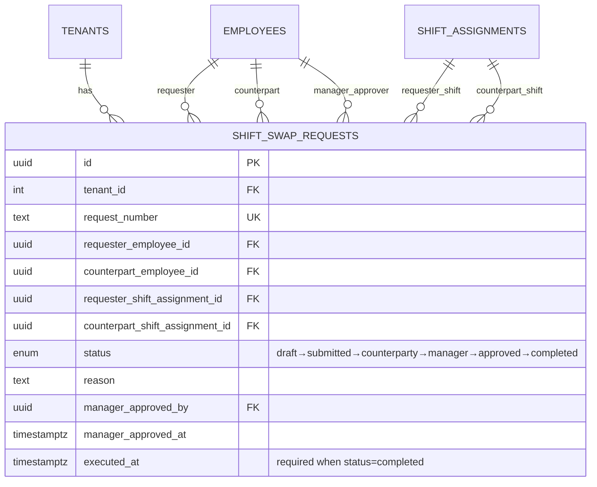
```mermaid
erDiagram
    TENANTS ||--o{ SHIFT_SWAP_REQUESTS : has
    EMPLOYEES ||--o{ SHIFT_SWAP_REQUESTS : requester
    EMPLOYEES ||--o{ SHIFT_SWAP_REQUESTS : counterpart
    EMPLOYEES ||--o{ SHIFT_SWAP_REQUESTS : manager_approver
    SHIFT_ASSIGNMENTS ||--o{ SHIFT_SWAP_REQUESTS : requester_shift
    SHIFT_ASSIGNMENTS ||--o{ SHIFT_SWAP_REQUESTS : counterpart_shift

    SHIFT_SWAP_REQUESTS {
        uuid id PK
        int tenant_id FK
        text request_number UK
        uuid requester_employee_id FK
        uuid counterpart_employee_id FK
        uuid requester_shift_assignment_id FK
        uuid counterpart_shift_assignment_id FK
        enum status "draft→submitted→counterparty→manager→approved→completed"
        text reason
        uuid manager_approved_by FK
        timestamptz manager_approved_at
        timestamptz executed_at "required when status=completed"
    }
```

## Shift swap workflow state diagram

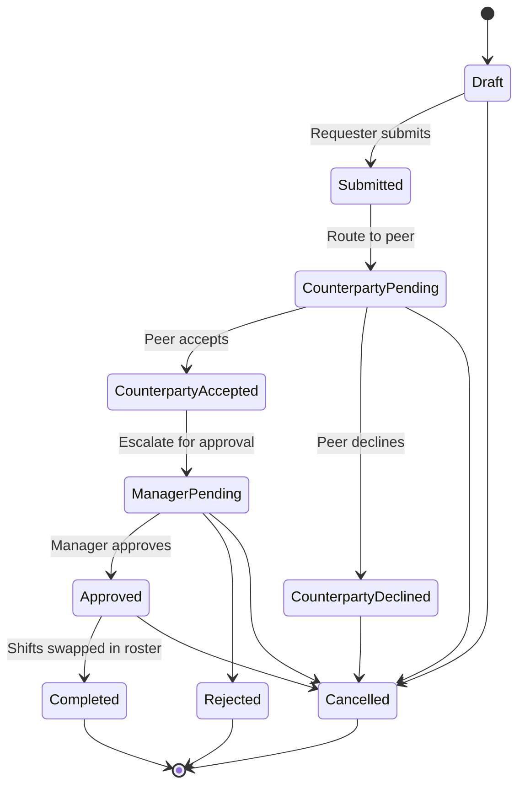
```mermaid
stateDiagram-v2
    [*] --> Draft
    Draft --> Submitted : Requester submits
    Draft --> Cancelled
    Submitted --> CounterpartyPending : Route to peer
    CounterpartyPending --> CounterpartyAccepted : Peer accepts
    CounterpartyPending --> CounterpartyDeclined : Peer declines
    CounterpartyPending --> Cancelled
    CounterpartyAccepted --> ManagerPending : Escalate for approval
    CounterpartyDeclined --> Cancelled
    ManagerPending --> Approved : Manager approves
    ManagerPending --> Rejected
    ManagerPending --> Cancelled
    Approved --> Completed : Shifts swapped in roster
    Approved --> Cancelled
    Completed --> [*]
    Rejected --> [*]
    Cancelled --> [*]
```

## Grievance Workflow State Diagram

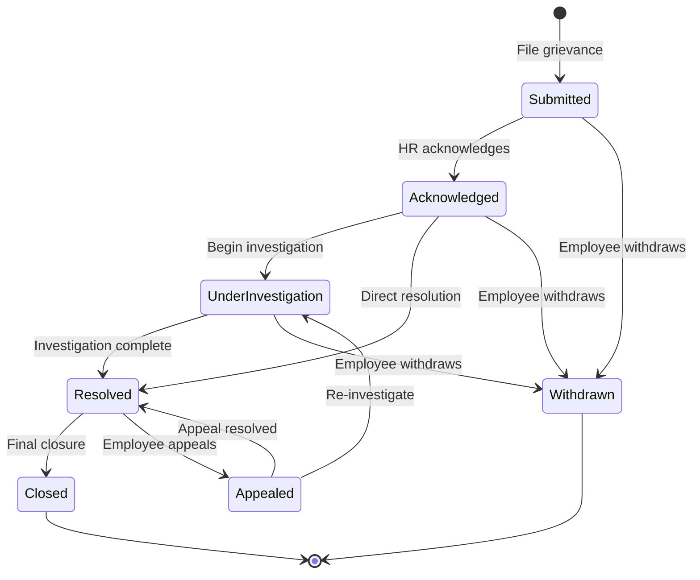
```mermaid
stateDiagram-v2
    [*] --> Submitted : File grievance
    Submitted --> Acknowledged : HR acknowledges
    Submitted --> Withdrawn : Employee withdraws
    Acknowledged --> UnderInvestigation : Begin investigation
    Acknowledged --> Resolved : Direct resolution
    Acknowledged --> Withdrawn : Employee withdraws
    UnderInvestigation --> Resolved : Investigation complete
    UnderInvestigation --> Withdrawn : Employee withdraws
    Resolved --> Closed : Final closure
    Resolved --> Appealed : Employee appeals
    Appealed --> UnderInvestigation : Re-investigate
    Appealed --> Resolved : Appeal resolved
    Closed --> [*]
    Withdrawn --> [*]
```

## Loan Lifecycle State Diagram

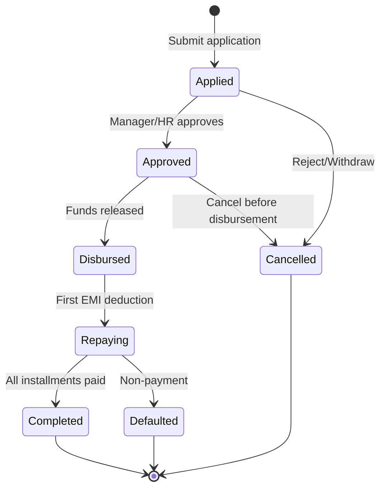
```mermaid
stateDiagram-v2
    [*] --> Applied : Submit application
    Applied --> Approved : Manager/HR approves
    Applied --> Cancelled : Reject/Withdraw
    Approved --> Disbursed : Funds released
    Approved --> Cancelled : Cancel before disbursement
    Disbursed --> Repaying : First EMI deduction
    Repaying --> Completed : All installments paid
    Repaying --> Defaulted : Non-payment
    Completed --> [*]
    Defaulted --> [*]
    Cancelled --> [*]
```

---

## Generated On

**Date:** 2026-03-30
**Tool:** Manual diagrams aligned to `packages/db/src/schema/hr/*.ts` and `hrRelations`
**Version:** HR Schema v2.3 (docs + diagram refresh; see `HR_SCHEMA_UPGRADE_GUIDE.md`)
