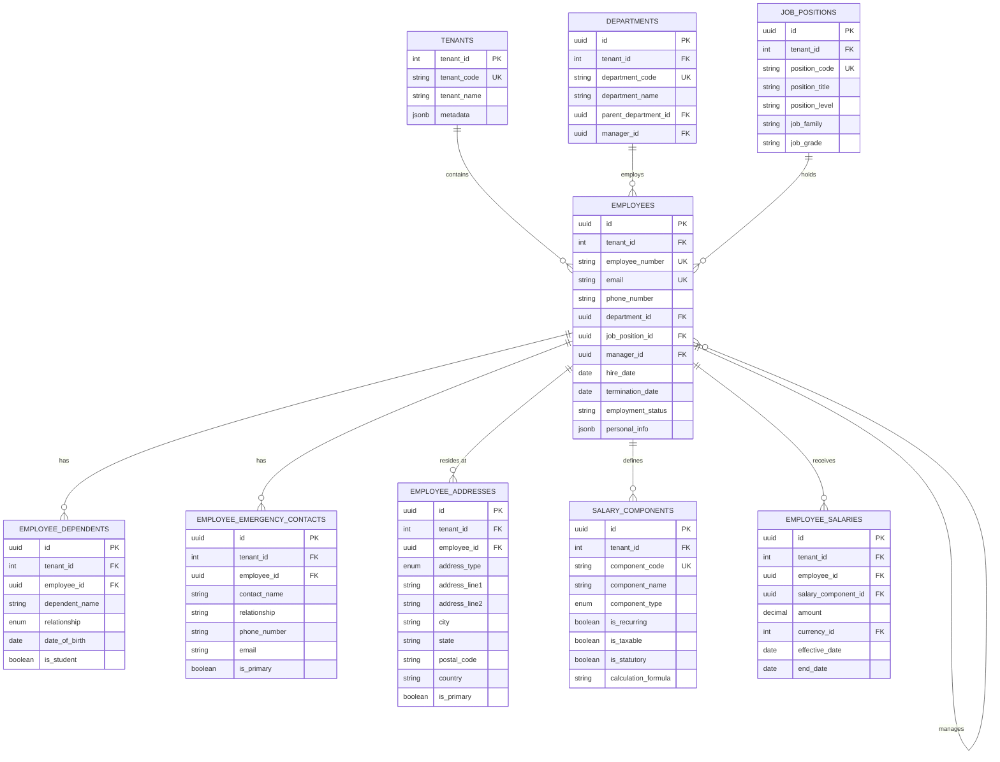
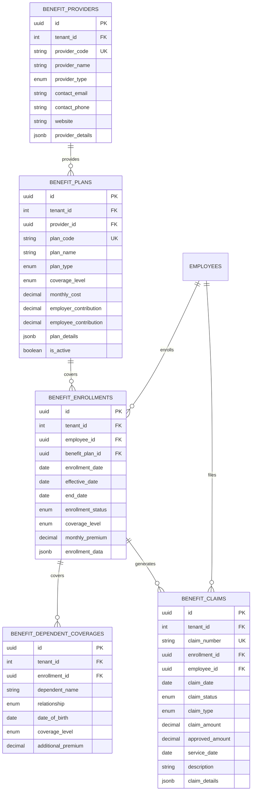
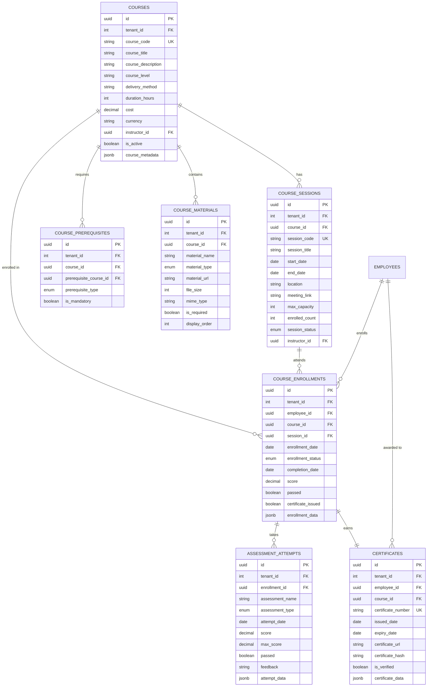
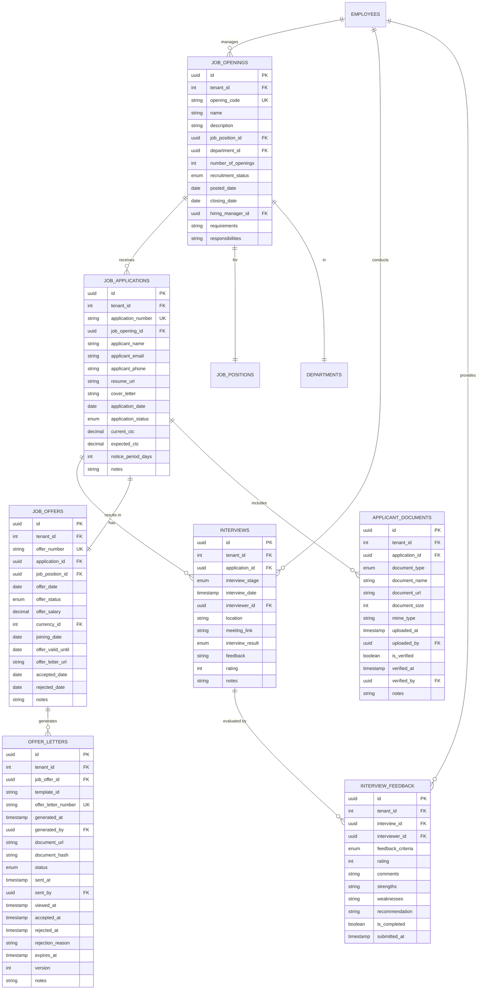
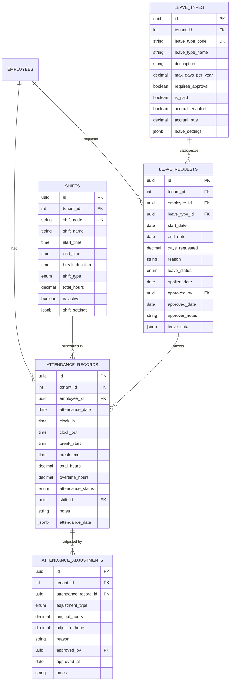
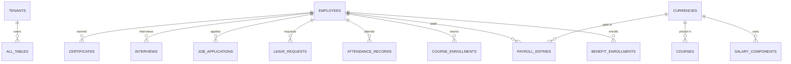
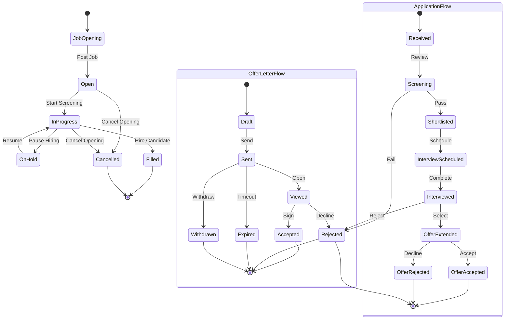
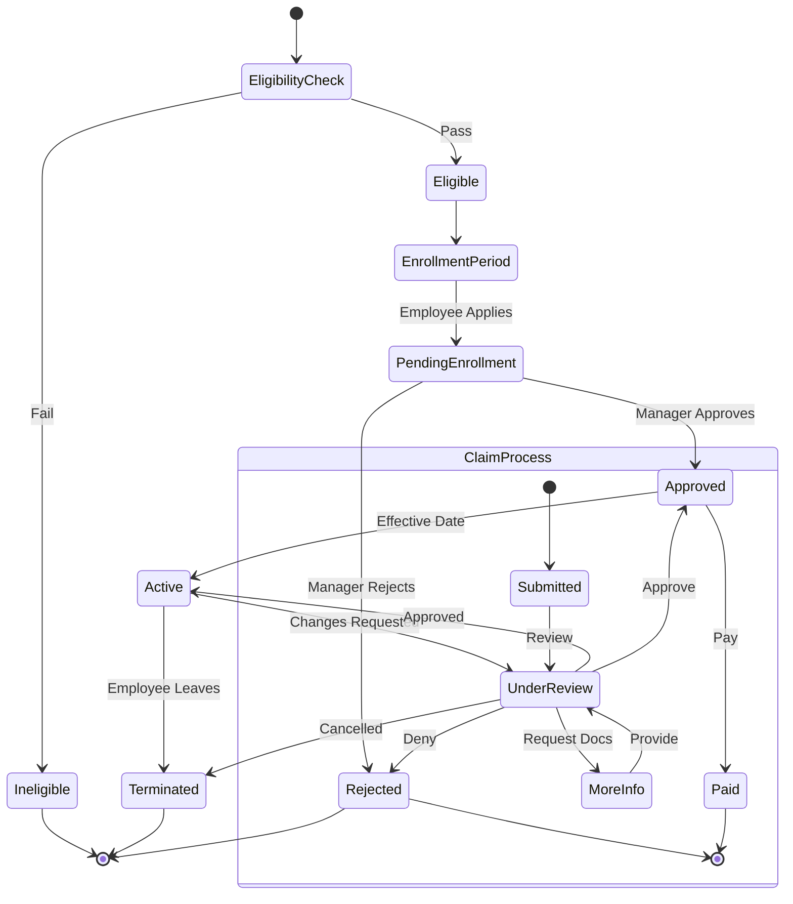
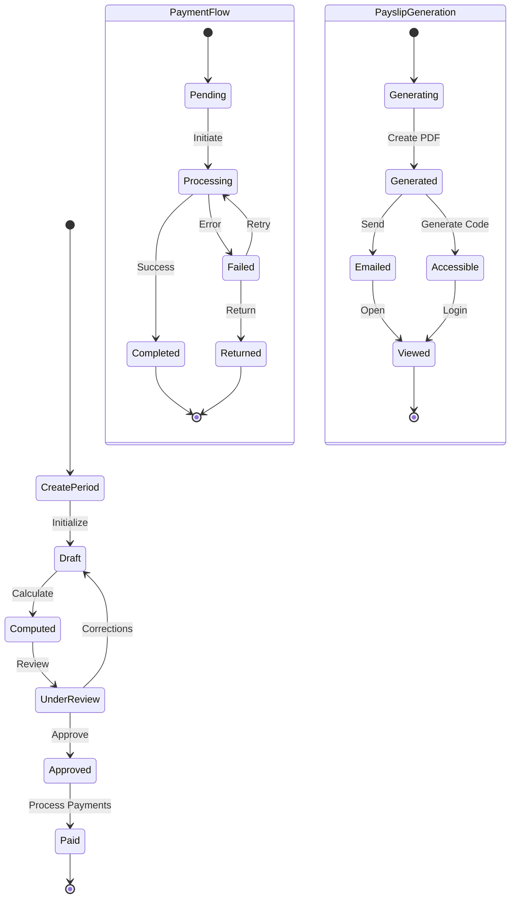

# HR Schema Diagrams

**Date:** 2026-03-29
**Version:** 2.0
**Domains:** 6 (People, Benefits, Learning, Payroll, Recruitment, Attendance)

---

## Overview

This document contains Entity Relationship Diagrams (ERDs) for all HR domains using Mermaid syntax. Each diagram shows the relationships between tables, primary keys (PK), foreign keys (FK), and important constraints.

---

## People Domain ERD

---

## Benefits Domain ERD

---

## Learning Domain ERD

---

## Payroll Domain ERD

---

## Recruitment Domain ERD

---

## Attendance Domain ERD

---

## Cross-Domain Relationships

---

## Legend

| Symbol | Meaning     |
| ------ | ----------- | ---- | ----------- | --- | ---------- |
| PK     | Primary Key |
| FK     | Foreign Key |
| UK     | Unique Key  |
|        |             | --o{ | One to Many |
|        |             | --   |             |     | One to One |
| }o--   |             |      | Many to One |

---

## Notes

1. **Tenant Isolation**: All tables include `tenant_id` for multi-tenancy
2. **Audit Columns**: Most tables include `created_at`, `updated_at`, `created_by`, `updated_by`
3. **Soft Delete**: Many tables include `deleted_at` for soft deletion
4. **JSONB Fields**: Used for flexible metadata and extensible data storage
5. **Enums**: Used for controlled vocabularies and status tracking

---

## Workflow State Diagrams

### 1. Recruitment Workflow

### 2. Benefits Enrollment Workflow

### 3. Payroll Processing Workflow

---

## Generated On

**Date:** 2026-03-29
**Tool:** Manual generation based on schema definitions
**Version:** HR Schema v2.0
