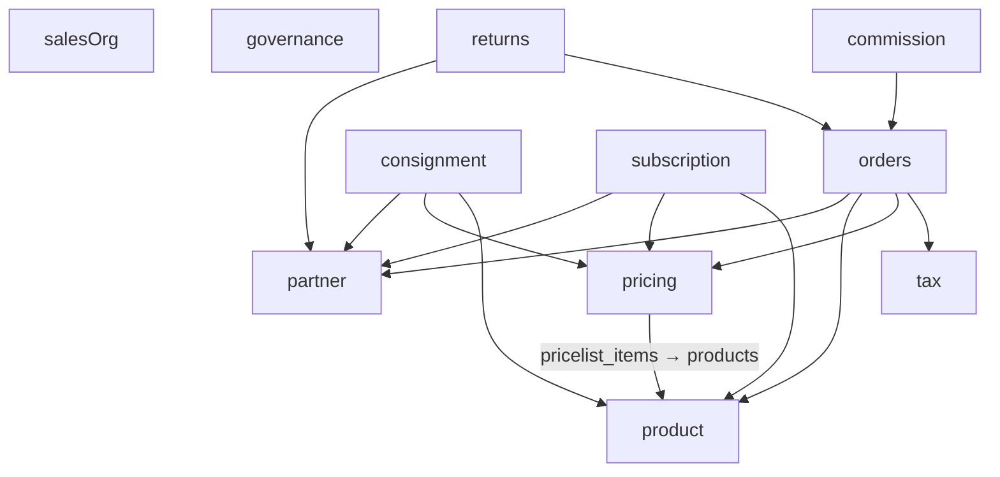

# Sales Domain Schema — Architecture

> **Status:** Active production schema with incremental refactor planned
> **Import path:** `@afenda/db` (submodule: `src/schema/sales`)
> **Tests:** Schema quality and database test suites in `packages/db/src/**/__test__`
> **Runtime deps:** `drizzle-orm`, Postgres schema objects, shared column-kit and RLS utilities

---

## Design philosophy

| Old approach | New approach |
| ------------ | ------------ |
| One large monolithic table file is easy to append to, but hard to govern over time. | Keep behavior unchanged, but refactor by bounded context with strict architecture contracts. |
| Changes can focus on new features without synchronized relation/doc updates. | Every structural change updates tables, relations, docs, and migration artifacts together. |
| Legacy vs new-planning tables can drift in documentation. | Legacy and new-planning tables are both first-class and kept explicitly in inventory. |

---

## Sales schema role

The Sales schema provides tenant-scoped transactional data for partner management, product/pricing, order lifecycle, taxation, consignment, returns, subscriptions, sales operations, commission, and governance logs.

- **Upstream consumers:** API routes, query/access modules, reporting jobs, CI schema-quality gates
- **Downstream:** Postgres `sales.*` physical schema, generated migrations, governance docs
- **Boundary:** schema definitions only; no business workflow orchestration or mutation gateways in this module

### Boundary position

```
apps/api + query modules
        -> schema/sales (drizzle declarations + zod contracts)
             -> postgres sales schema + migrations
```

---

## Structure snapshot

Bounded-context modules mirror **HR** naming: `lowerCamelCase.ts` per domain, no `tables.` prefix.

```
sales/
├── _schema.ts
├── _enums.ts
├── _zodShared.ts
├── _relations.ts
├── partner.ts                  # Layer 0 — 10 tables + Zod + types
├── partnerEventCatalog.ts      # catalog exports (no tables)
├── product.ts                  # Layer 0 — 9 tables + Zod + types
├── tax.ts                      # Layer 0 — 8 tables + Zod + types
├── salesOrg.ts                 # Layer 0 — 5 tables + Zod + types
├── governance.ts               # Layer 0 — 7 tables + Zod + types
├── pricing.ts                  # Layer 1 — 6 tables (FK → product)
├── orders.ts                   # Layer 2 — 6 tables (FK → partner, product, pricing, tax)
├── documentTruthLinks.ts       # 1 table
├── truthBindings.ts            # 1 table
├── pricingDecisions.ts         # 1 table
├── pricingTruth.ts             # 2 tables
├── glAccounts.ts               # 1 table
├── journal.ts                  # 2 tables
├── accountingDecisions.ts      # 1 table
├── consignment.ts              # Layer 3 — 4 tables
├── subscription.ts             # Layer 3 — 8 tables
├── returns.ts                  # Layer 3 — 3 tables
├── commission.ts               # Layer 3 — 5 tables
├── CUSTOM_SQL_REGISTRY.json
├── README.md
├── ARCHITECTURE.md
├── sales-docs/
│   └── SCHEMA_ENVELOPE.md
└── index.ts
```

---

## Table-first schema analysis

### Inventory snapshot

- Total table declarations across domain modules: **80** (18 files with `salesSchema.table`; `partnerEventCatalog.ts` has none)
- Total enum declarations in `_enums.ts`: **54**
- All table refactor tasks must preserve table set unless explicit removal approval exists.

### Schema-basis breakdown → domain file

| Domain file | Table count | Tables |
| --- | ---: | --- |
| `partner.ts` | 10 | `partners`, `partner_addresses`, `partner_bank_accounts`, `partner_tags`, `partner_tag_assignments`, `partner_contact_snapshots`, `partner_address_snapshots`, `partner_events`, `partner_financial_projections`, `partner_reconciliation_links` |
| `product.ts` | 9 | `product_categories`, `products`, `product_templates`, `product_attributes`, `product_attribute_values`, `product_template_attribute_lines`, `product_template_attribute_values`, `product_variants`, `product_packaging` |
| `tax.ts` | 8 | `tax_groups`, `tax_rates`, `tax_rate_children`, `fiscal_positions`, `fiscal_position_states`, `fiscal_position_tax_maps`, `fiscal_position_account_maps`, `tax_resolutions` |
| `orders.ts` | 6 | `sales_orders`, `sales_order_lines`, `sale_order_option_lines`, `sale_order_status_history`, `sale_order_line_taxes`, `sale_order_tax_summary` |
| `pricing.ts` | 6 | `payment_terms`, `payment_term_lines`, `pricelists`, `pricelist_items`, `line_item_discounts`, `rounding_policies` |
| `documentTruthLinks.ts` | 1 | `sales_order_document_truth_links` |
| `truthBindings.ts` | 1 | `document_truth_bindings` |
| `pricingDecisions.ts` | 1 | `sales_order_pricing_decisions` |
| `pricingTruth.ts` | 2 | `sales_order_price_resolutions`, `price_resolution_events` |
| `glAccounts.ts` | 1 | `gl_accounts` |
| `journal.ts` | 2 | `journal_entries`, `journal_lines` |
| `accountingDecisions.ts` | 1 | `accounting_decisions` |
| `consignment.ts` | 4 | `consignment_agreements`, `consignment_agreement_lines`, `consignment_stock_reports`, `consignment_stock_report_lines` |
| `returns.ts` | 3 | `return_reason_codes`, `return_orders`, `return_order_lines` |
| `subscription.ts` | 8 | `subscription_statuses`, `subscription_close_reasons`, `subscription_templates`, `subscriptions`, `subscription_pricing_resolutions`, `subscription_lines`, `subscription_logs`, `subscription_compliance_audit` |
| `salesOrg.ts` | 5 | `sales_teams`, `sales_team_members`, `territories`, `territory_rules`, `territory_resolutions` |
| `commission.ts` | 5 | `commission_plans`, `commission_plan_tiers`, `commission_entries`, `commission_resolutions`, `commission_liabilities` |
| `governance.ts` | 7 | `document_status_history`, `document_approvals`, `document_attachments`, `accounting_postings`, `domain_invariant_logs`, `domain_event_logs`, `truth_decision_locks` |

### Legacy + new planning continuity

- Legacy foundation tables and new-planning tables are both valid and must stay represented.
- Refactor by default means file and architecture decomposition only.
- Table drop/merge/semantic retirement is forbidden unless explicitly requested and migration-approved.

### Table evolution rules

- Additive change is default (new columns, new constraints, new tables).
- Rename/drop requires explicit approval, backfill strategy, and reversible migration plan.
- Any FK/index/check change must update `_relations.ts` and docs in the same PR.
- Any non-Drizzle SQL must be registered in `CUSTOM_SQL_REGISTRY.json`.

---

## Core architecture

### 1) Layered schema primitives

- `_schema.ts`: single schema primitive (`salesSchema`)
- `_enums.ts`: enum source of truth (tuple -> pgEnum -> Zod -> type)
- `_zodShared.ts`: reusable branded IDs and scalar validators
- Domain `*.ts` files: physical table definitions, constraints, indexes, foreign keys, RLS, and table-scoped Zod/types
- `_relations.ts`: semantic relation map aligned to table edges

### 2) Governance envelope

- DRY: shared enums/validators/column helper reuse
- Drift control: schema + relations + docs + migration synchronized
- Consistency: tenant-aware indexing, explicit FK actions, money precision checks
- Refactor safety: behavior-preserving modularization with stable exports

### HR parity notes

- Naming, module layout, and `_schema`/`_enums`/`_zodShared`/`_relations` split are aligned with HR.
- Sales currently uses more `drizzle-orm/zod` generated schemas; HR contains more hand-authored insert contract objects.
- FK modeling details may differ per bounded context; parity target is governance quality, not forced identical SQL shape.
- Query access layer keeps an intentional aggregate scaffold at `queries/sales/tables.access.ts`; db-access gate maps all sales schema modules to that single access entrypoint.

---

## Refactor sequencing (dependency DAG)

Cross-domain FKs form a DAG (no cycles). Extract in layers; after each file, `pnpm --filter @afenda/db typecheck` must pass.

### Dependency diagram



### Layer order

1. **Layer 0:** `partner.ts`, `product.ts`, `tax.ts`, `salesOrg.ts`, `governance.ts` (and other modules without upward dependencies into orders)
2. **Layer 1:** `pricing.ts`
3. **Layer 2:** `orders.ts`
4. **Layer 3:** `consignment.ts`, `subscription.ts`, `returns.ts`, `commission.ts`

5. **Truth / pricing / accounting:** `truthBindings.ts`, `documentTruthLinks.ts`, `pricingDecisions.ts`, `pricingTruth.ts`, `glAccounts.ts`, `journal.ts`, `accountingDecisions.ts` — ordering follows **actual imports** between these files and layers above; use typecheck when in doubt.

6. **Barrel:** `index.ts` exports each domain module; remove any temporary monolith shim.

Each step is behavior-preserving; update `_relations.ts` when FK edges change.

---

## Governance rules

1. Table-first analysis before any structural change
2. Legacy and new-planning table continuity by default
3. `_enums` and `_zodShared` are the only allowed shared-definition sources
4. `_relations.ts` must be updated alongside FK model changes
5. `CUSTOM_SQL_REGISTRY.json` is mandatory for non-Drizzle SQL
6. Migration, docs, and schema updates ship together

---

## Summary

Sales schema architecture is documented with explicit table-first inventory, bounded-context files aligned to HR naming, and continuity policy for legacy plus new-planning tables. This enables safe modularization without accidental model loss or undocumented drift.

**Related:** [README.md](./README.md), [sales-docs/SCHEMA_ENVELOPE.md](./sales-docs/SCHEMA_ENVELOPE.md), [sales-docs/STABILITY_CONTRACT.md](./sales-docs/STABILITY_CONTRACT.md), [sales-docs/SCHEMA_LOCKDOWN.md](./sales-docs/SCHEMA_LOCKDOWN.md)
