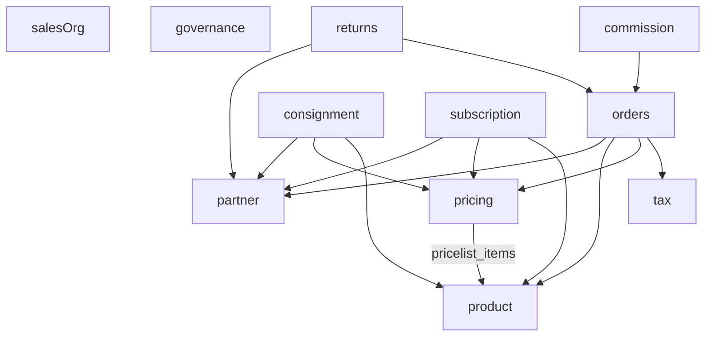

# Sales Domain Schema

> **Schema:** `sales` (`pgSchema("sales")`)
> **Package:** `@afenda/db`
> **Path:** `packages/db/src/schema/sales/`
> **Tables:** **80** across **18** bounded-context domain modules that declare tables (HR-style `lowerCamelCase.ts` filenames; `partnerEventCatalog.ts` exports catalog only — no `salesSchema.table`)
> **Enums:** **54** (`salesSchema.enum(` in `_enums.ts`)
> **Relations catalog:** `_relations.ts` (source of truth for Sales-to-Sales relation semantics)
> **Custom SQL registry:** `CUSTOM_SQL_REGISTRY.json` (mandatory for non-Drizzle SQL)

## Architecture Contract (HR-Aligned Discipline)

This domain follows the same layout discipline as `hr` while allowing sales-specific implementation choices:

- `_schema.ts` owns schema namespace only (`salesSchema = pgSchema("sales")`)
- `_enums.ts` owns enum value catalogs, pgEnum declarations, Zod schemas, and enum types
- `_zodShared.ts` owns branded IDs and shared scalar validation schemas
- Domain files (`partner.ts`, `product.ts`, …) own table definitions, constraints, indexes, foreign keys, RLS, matching Zod trios, and inferred types per bounded context
- `_relations.ts` owns a normalized relation catalog for documentation, onboarding, and drift checks
- `index.ts` is the public API barrel for all Sales schema exports

Keep responsibilities separated. Do not move table definitions into `_enums.ts` or `_relations.ts`, and do not define ad-hoc enums inline inside domain table files.

### Sales vs HR intentional differences

- Sales currently co-locates most contracts via `createSelectSchema` / `createInsertSchema` / `createUpdateSchema`.
- HR uses more hand-authored insert schema objects and additional HR-specific docs and policies.
- This is an implementation difference only; naming, bounded-context split, and governance discipline remain aligned.

## Table-first inventory and schema basis

The Sales schema defines **80 tables** across domain modules. Refactor planning must begin with this inventory and the dependency DAG, not ad-hoc filename splits. The **per-file table catalog** below is authoritative for names and counts; CI enforces relations drift via `packages/db/src/schema/sales/__test__/contracts.test.ts` and `tools/ci-gate/drizzle-schema-quality`.

| Schema basis | Tables |
| --- | --- |
| Partner master and identities | `partners`, `partner_addresses`, `partner_bank_accounts`, `partner_tags`, `partner_tag_assignments`, `partner_contact_snapshots`, `partner_address_snapshots`, `partner_events`, `partner_financial_projections`, `partner_reconciliation_links` |
| Product catalog (legacy + operational) | `product_categories`, `products` |
| Product configuration (new planning track) | `product_templates`, `product_attributes`, `product_attribute_values`, `product_template_attribute_lines`, `product_template_attribute_values`, `product_variants`, `product_packaging` |
| Sales order lifecycle | `sales_orders`, `sales_order_lines`, `sale_order_option_lines`, `sale_order_status_history`, `sale_order_line_taxes`, `sale_order_tax_summary` |
| Pricing and terms | `payment_terms`, `payment_term_lines`, `pricelists`, `pricelist_items`, `line_item_discounts`, `rounding_policies` |
| Tax and fiscal mapping | `tax_groups`, `tax_rates`, `tax_rate_children`, `fiscal_positions`, `fiscal_position_states`, `fiscal_position_tax_maps`, `fiscal_position_account_maps`, `tax_resolutions` |
| Truth, pricing decisions, and price resolutions | `document_truth_bindings`, `sales_order_document_truth_links`, `sales_order_pricing_decisions`, `sales_order_price_resolutions`, `price_resolution_events` |
| GL, journal, and accounting decisions | `gl_accounts`, `journal_entries`, `journal_lines`, `accounting_decisions` |
| Consignment | `consignment_agreements`, `consignment_agreement_lines`, `consignment_stock_reports`, `consignment_stock_report_lines` |
| Returns | `return_reason_codes`, `return_orders`, `return_order_lines` |
| Subscription billing | `subscription_statuses`, `subscription_close_reasons`, `subscription_templates`, `subscriptions`, `subscription_pricing_resolutions`, `subscription_lines`, `subscription_logs`, `subscription_compliance_audit` |
| Sales org and territories | `sales_teams`, `sales_team_members`, `territories`, `territory_rules`, `territory_resolutions` |
| Commission | `commission_plans`, `commission_plan_tiers`, `commission_entries`, `commission_resolutions`, `commission_liabilities` |
| Governance, postings, and audit | `document_status_history`, `document_approvals`, `document_attachments`, `accounting_postings`, `domain_invariant_logs`, `domain_event_logs`, `truth_decision_locks` |

### Legacy + new planning continuity policy

- Legacy foundation tables and new-planning tables are both first-class and must remain part of the model.
- No table drop, merge, or semantic retirement is allowed unless explicitly requested and migration-approved.
- Refactor work is structural (file/module organization, docs, relation synchronization), not functional removal.

## 1) Pattern Definitions

### `_enums` pattern

- Define tuple constants first (for example `orderStatuses`)
- Define pgEnums from tuples via `salesSchema.enum(...)`
- Define matching Zod enums from the same tuples
- Export inferred types from Zod schemas
- Rule: add enum values additively unless a migration-approved breaking change is explicitly planned

### `_relations` pattern

- Keep legacy FK topology in `salesRelations` (`SalesRelationDefinition`) for drift checks and table-level contract validation
- Model deterministic runtime edges in `salesTruthGraph` using `TruthEdge` (`role`, `direction`, execution hints, constraints)
- Use semantic edge IDs for the runtime graph (`order_composes_lines`, `truth_binding_supersedes_binding`)
- Split runtime graph layers by intent: `truth`, `operational`, and `audit`
- When adding or changing FK edges in a sales domain `*.ts` table file, update `_relations.ts` in the same change (both legacy relation and any affected truth edge)

### `_schema` pattern

- `salesSchema` is the single schema namespace primitive
- All table and enum declarations must use `salesSchema`
- Never hardcode `"sales"` schema names in table builders outside `_schema.ts`

### `_shared` pattern (`_zodShared`)

- Brand every entity ID with `z.uuid().brand<...>()`
- Keep shared numeric/string validators centralized (`money`, `quantity`, `percentage`)
- Reuse shared schemas from table-level insert/update/select schema composition
- Do not duplicate shared scalar validators inside table-local schema blocks

## 2) Custom SQL Registry Rule

`CUSTOM_SQL_REGISTRY.json` is mandatory for Sales custom SQL that is not generated by Drizzle.

Use it for:

- circular FK SQL
- partial indexes or expressions that Drizzle cannot represent safely
- advanced constraints, triggers, or compatibility DDL requiring hand-authored SQL

Workflow:

1. Add an entry with status `pending`
2. Generate migration with Drizzle normally
3. Append vetted custom SQL into migration
4. Mark entry as `applied` and record migration filename

Never merge custom SQL without registering it in `CUSTOM_SQL_REGISTRY.json`.

## 3) Envelope: DRY, Drift, Consistency, Refactor

### DRY envelope

- Centralize enums in `_enums.ts`
- Centralize branded IDs and shared validators in `_zodShared.ts`
- Reuse common column helpers (`timestampColumns`, `auditColumns`, `softDeleteColumns`, `nameColumn`)
- Keep RLS policy application uniform (`tenantIsolationPolicies`, `serviceBypassPolicy`)

### Drift envelope

- Schema drift: any table FK/index/check change must be reflected in `_relations.ts` and docs
- Enum drift: tuple, pgEnum, Zod schema, and exported type must stay aligned
- Migration drift: manual SQL must be tracked in `CUSTOM_SQL_REGISTRY.json`

### Consistency envelope

- All tenant-scoped tables use `tenantId` and tenant-leading indexes
- FKs should have explicit `onDelete` and `onUpdate`
- Money fields use numeric with explicit precision/scale and check constraints where needed
- Soft-delete aware unique indexes should use `deletedAt IS NULL` filters where applicable

### Refactor envelope

- Prefer additive, backward-compatible refactors
- Keep new tables in the smallest bounded-context module that matches the DAG; preserve public exports via `index.ts`
- Keep naming stable and business semantic (avoid internal shorthand in SQL identifiers)
- Require migration + relations + docs updates in a single PR for structural refactors

## Domain file map (HR-identical convention)

Filename = **bounded context** in **lowerCamelCase** (same rule as `packages/db/src/schema/hr/`). Schema identity lives in the directory path (`schema/sales/`), not in a `tables.` or `sales.` filename prefix.

### Directory layout

```
sales/
├── _schema.ts
├── _enums.ts
├── _zodShared.ts
├── _relations.ts
├── partner.ts              # Layer 0
├── partnerEventCatalog.ts  # catalog exports (no tables)
├── product.ts
├── tax.ts
├── salesOrg.ts
├── governance.ts
├── pricing.ts              # Layer 1 (FK → product)
├── orders.ts               # Layer 2 (FK → partner, product, pricing, tax)
├── documentTruthLinks.ts
├── truthBindings.ts
├── pricingDecisions.ts
├── pricingTruth.ts
├── glAccounts.ts
├── journal.ts
├── accountingDecisions.ts
├── consignment.ts          # Layer 3
├── subscription.ts
├── returns.ts
├── commission.ts
├── CUSTOM_SQL_REGISTRY.json
├── README.md
├── ARCHITECTURE.md
├── sales-docs/
└── index.ts                # barrel: re-exports all domain modules
```

### Dependency DAG (cross-domain FKs)



No circular cross-group dependencies.

### Extraction sequence (matches DAG)

Core transactional layers:

1. **Layer 0:** `partner.ts`, `product.ts`, `tax.ts`, `salesOrg.ts`, `governance.ts` (and other modules with no upward FKs into sales orders)
2. **Layer 1:** `pricing.ts` (imports `product` for `pricelist_items`)
3. **Layer 2:** `orders.ts` (imports partner, product, pricing, tax)
4. **Layer 3:** `consignment.ts`, `subscription.ts`, `returns.ts`, `commission.ts`

Truth, pricing head, and accounting modules (`truthBindings.ts`, `documentTruthLinks.ts`, `pricingDecisions.ts`, `pricingTruth.ts`, `glAccounts.ts`, `journal.ts`, `accountingDecisions.ts`) follow the **live import graph** between files; there is no single linear sequence that replaces `pnpm --filter @afenda/db typecheck` when adding edges.

### Per-file table catalog

| File | Tables |
| --- | --- |
| `partner.ts` | `partners`, `partner_addresses`, `partner_bank_accounts`, `partner_tags`, `partner_tag_assignments`, `partner_contact_snapshots`, `partner_address_snapshots`, `partner_events`, `partner_financial_projections`, `partner_reconciliation_links` |
| `product.ts` | `product_categories`, `products`, `product_templates`, `product_attributes`, `product_attribute_values`, `product_template_attribute_lines`, `product_template_attribute_values`, `product_variants`, `product_packaging` |
| `tax.ts` | `tax_groups`, `tax_rates`, `tax_rate_children`, `fiscal_positions`, `fiscal_position_states`, `fiscal_position_tax_maps`, `fiscal_position_account_maps`, `tax_resolutions` |
| `salesOrg.ts` | `sales_teams`, `sales_team_members`, `territories`, `territory_rules`, `territory_resolutions` |
| `governance.ts` | `document_status_history`, `document_approvals`, `document_attachments`, `accounting_postings`, `domain_invariant_logs`, `domain_event_logs`, `truth_decision_locks` |
| `pricing.ts` | `payment_terms`, `payment_term_lines`, `pricelists`, `pricelist_items`, `line_item_discounts`, `rounding_policies` |
| `orders.ts` | `sales_orders`, `sales_order_lines`, `sale_order_option_lines`, `sale_order_status_history`, `sale_order_line_taxes`, `sale_order_tax_summary` |
| `documentTruthLinks.ts` | `sales_order_document_truth_links` |
| `truthBindings.ts` | `document_truth_bindings` |
| `pricingDecisions.ts` | `sales_order_pricing_decisions` |
| `pricingTruth.ts` | `sales_order_price_resolutions`, `price_resolution_events` |
| `glAccounts.ts` | `gl_accounts` |
| `journal.ts` | `journal_entries`, `journal_lines` |
| `accountingDecisions.ts` | `accounting_decisions` |
| `consignment.ts` | `consignment_agreements`, `consignment_agreement_lines`, `consignment_stock_reports`, `consignment_stock_report_lines` |
| `returns.ts` | `return_reason_codes`, `return_orders`, `return_order_lines` |
| `subscription.ts` | `subscription_statuses`, `subscription_close_reasons`, `subscription_templates`, `subscriptions`, `subscription_pricing_resolutions`, `subscription_lines`, `subscription_logs`, `subscription_compliance_audit` |
| `commission.ts` | `commission_plans`, `commission_plan_tiers`, `commission_entries`, `commission_resolutions`, `commission_liabilities` |

**Total:** **80** `salesSchema.table(` declarations across the **18** domain files above (`partnerEventCatalog.ts` has none).

All extractions are behavior-preserving: same Drizzle table names, constraints, RLS, and public exports via `index.ts`.

## Import Rules

```ts
// External package consumers: import from package barrel
import { salesOrders, salesOrderLines } from "@afenda/db";

// Internal sales files: use relative imports
import { salesSchema } from "./_schema.js";
```

## Related documentation

- [ARCHITECTURE.md](./ARCHITECTURE.md) — Detailed table-first architecture and refactor sequencing
- [sales-docs/SCHEMA_ENVELOPE.md](./sales-docs/SCHEMA_ENVELOPE.md) — DRY/drift/consistency operational guardrails
- [sales-docs/STABILITY_CONTRACT.md](./sales-docs/STABILITY_CONTRACT.md) — Stabilization checklist, automation guardrails, and residual risk notes
- [sales-docs/SCHEMA_LOCKDOWN.md](./sales-docs/SCHEMA_LOCKDOWN.md) — Enterprise governance rules and mandatory schema conventions

